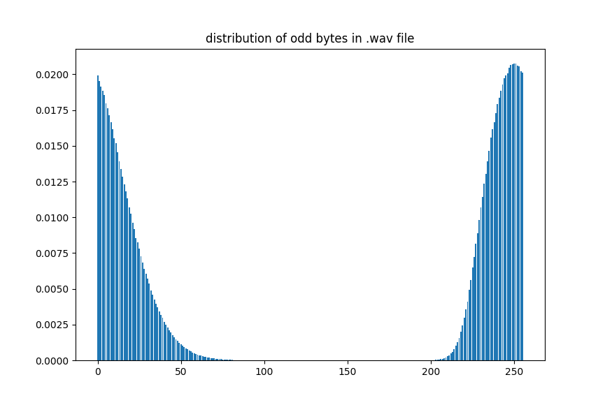

# WAV-RNG

**Note: This project is a work-in-progress. The random number generator in this project should not be used for security or cryptographic purposes.**

## Introduction
Generating truly random numbers is hard. By definition, computers cannot generate random numbers since they are deterministic. Instead, computers can generate *pseudorandom* numbers. Pseudorandom number generators (PRNGs) use algorithms that take a seed, or starting value, and generate sequences of numbers that approximate the (statistical) properties of sequences of random numbers. Some of these are quite good, and are used for cryptographic purposes, but they cannot be said to be *true* random number generators (TRNGs, or just RNGs). 

While PRNGs generate sequences of numbers that look random, but are in fact predetermined by the algorithm and seed, RNGs generate random numbers based on physical phenomena that are expected to be random. Examples of such physical phenomena include atmospheric noise, thermal noise, and radioactive decay. In this project, we will use the former as a basis of our random number generator. Specifically, this project includes Python code that generates random numbers, in a variety of different formats, from .wav files containing recorded atmospheric noise. A driver script `rng.py` allows users to easily interact with the RNG.

The rest of this document is broken up into four sections. In the first, I give an overview of how to use the RNG driver program, `rng.py`, to generate random numbers from .wav files containing recorded atmospheric noise. Next, I describe the methodology and intuition for the RNG in more detail. In the third section, I discuss the testing of the RNG. Finally, I end with some concluding remarks and areas of future improvement.

## Using `rng.py`
(In addition to this section, this information is available in a more condensed form which you can access by running `python3 rng.py -h`. )

Running the `rng.py` script to generate random numbers is very simple. For the most basic usage, you can run `python3 rng.py --in <input.wav>` for any input .wav file. This will print out, as a Python `bytearray`, all the random bytes generated by the .wav file. For a more readable format, you can choose from the `--ascii`, `--binary`, `--hex`, or `--digits` options to get the data in the specified formats. See examples below:

`$ python3 rng.py --in noise.wav --ascii`
output: `CfqGbj[LMa^{lK[{AAk>Agzc?tpC-[lFh&0zj1KS,4=7_Lb_RlBt1k+6voR(}_5E*K#=`

`$ python3 rng.py --in noise.wav --digits`
output: `60072664111942976342295533921735145761721749824549653603 ...`.

To write output to a file, you can run with the `--out` option, followed by a filename:
`$ python3 rng.py --in noise.wav --digits --out random_digits.txt`

The same can be done with any format, including raw bytes, which is the default mode of output. This will produce a raw binary file with the generated data.

Often times, a user may have a large .wav file, but may want only a portion of the random data in can generate. Firstly, to check how much random data a .wav file can generate, run,
`$python3 rng.py --in noise.wav -q`.
This runs the "query" function, which will return how many available bytes can be generated, with output: `available bytes for noise.wav: 580753524`.

This tells us that our file `noise.wav` can generate about 580MB of random data.

Now, suppose we want only a fraction of those raw bytes. We can specify the starting and ending bytes to print with the `-s` and `-e` flags. Start is inclusive, while end is exclusive. In mathematical notation, the range: [start, end). Without specifying either, the start position defaults to zero, and the end position defaults to the maximum given the file-size. However, since the RNG involves hashing the entropy from atmospheric noise, a minimum of 128 bytes can be requested, i.e. the difference between `-e` and `-s` must be at least 128:
`$python3 rng.py --in noise.wav -s 100 -e 228 --hex`
output: `a06b1aa4...`.


### Combining with pseudorandom data
`rng.py` provides the option of combining the random data generated from the .wav file with pseudorandom data from different sources. The only supported source now is the Python secrets module, with associated flag `--secrets`. The method of combining the random data is with the XOR function, which is discussed in more detail in the next section.

`$ python3 rng.py --in noise.wav -s 0 -e 256 --secrets --hex`

## Methodology and Technical Details
### Intuition
The methodology for this RNG is greatly inspired by Jeremy Triplett in his [medium post](https://jeremytriplett06.medium.com/using-atmospheric-noise-to-generate-true-random-numbers-dc820ac9452d) on the topic. As such, anyone who is interested in my methodology should read his overview. Additionally, his provided links to information about the [WAV](http://soundfile.sapp.org/doc/WaveFormat/) file format will be useful to anyone pursuing a similar project, or just trying to understand the details here. Another big help was [reallyreallyrandom](http://www.reallyreallyrandom.com/), which has a thorough overview on DIY RNG's like this one, and goes into some of the more technical/math details. Finally, random.org is a site that provides random data generated by atmospheric noise free of charge (up to a point). The site also has plenty of good reading material about randomness and the statistics of it all.

The basic idea behind the RNG is this: the waveform of [atmospheric noise](https://en.wikipedia.org/wiki/Atmospheric_noise), which is after all radio noise caused by natural atmospheric processes, should be random. The way that this waveform is captured in a .wav file is by a series of 16-bit samples. Basically, the data of a .wav file is a series of 16-bit numbers that describe the wave at different points in time, and these numbers should have some randomness in them. 

### Extracting Randomness from Entropy

You might think that since the waveform of atmospheric noise looks pretty random, and the .wav data essentially captures that waveform in a series of 16-bit integers, we can just take all the data in the .wav file and pass it off as random. This is problematic, however, because the values of the waveform at each point in time aren't [independent and identically distributed](https://en.wikipedia.org/wiki/Independent_and_identically_distributed_random_variables) (i.i.d. for short) data that we are looking for. They do contain [entropy](https://en.wikipedia.org/wiki/Entropy), however. (Another problem is the fact that .wav files have a 44-byte header, but this is easily remedied by simply skipping over those bytes).

More specifically, the type of randomness we are after is a special kind of i.i.d. data. The two "i's" here are important. The first, *independent*, means that each value should not depend on any other value. The second, *identically*, means that all the data share the same [probability distribution](https://en.wikipedia.org/wiki/Probability_distribution). Basically, when we generate bits, we want each bit to be independent of all the other bits (they don't depend on each other), and we want them to all share the same probability distribution—in this case, the [Bernoulli distribution](https://en.wikipedia.org/wiki/Bernoulli_distribution) with paramater *p = 0.5*. This distribution is a fancy way of describing an example we're all familiar with: a fair coin that lands on heads 50% of the time and tails 50% of the time, such that no coin flip depends on other coin flips.

But unfortunately for us, the waveform of atmospheric noise does not directly give us this type of i.i.d. data. To understand why, consider an example. Suppose we are measuring some sort of physical quantity over time. At a certain time, the quantity takes on the value 7378267 units. Over a short period of time, we expect the quantity to vary randomly in some direction, but the magnitude of that variation might not be very big. As an example, for a series of times, we might measure 7378382 units, then 7412868, then, 7351467, then 7382842 and so on. The variation from each sample to the next seems random, and yet the numbers taken in their entirety don't—namely because they don't vary enough to change the most significant digit (7), and hardly the second most significant digit (it changes from 3 to 4 but that's it). 

The same concept applies with the waveform of our atmospheric noise. A more formal way of putting the above is that the raw bytes from the .wav file will be highly [autocorrelated](https://en.wikipedia.org/wiki/Autocorrelation). This means that subsequent values will depend on each other, which is undesirable, since we're after i.i.d. data in which one byte tells us nothing about the next, or the next, or the next ...

To see this, take a look at the below figure. The top portion plots the raw byte values of the .wav file over time. (This is not exactly the same as plotting the raw signal, for which we would have to plot the 2-byte integers, but it still gives us a good picture as to what's happening). As you can see, the values are clumped together: several values appear very close together, then a large dip occurs, then the pattern repeats. This makes sense: after all, we are measuring the shape of a wave which, despite having random variations in it, still behaves like a wave. The bottom portion gives the autocorrelation of the signal. The x-axis corresponds to the difference in time/index of the signal (i.e., x=2 means we are looking at .wav bytes that are two bytes apart, x=3 means we are looking at byte values that are three bytes apart, etc.), and the y-axis corresponds to how correlated those signals are. For perfectly random i.i.d. data, we should have a spike at zero, since each point is always identical to itself, and an autocorrelation value very close to zero everywhere else. Instead we see spikes at 2, 4, 6, and 8. This means that bytes that are 2, 4, 6, or 8 places apart in the raw .wav file are rather highly correlated; knowing what value a given byte is tells us something about what the byte two bytes after it will be, and so on. This actually makes perfect sense if we recall how .wav files are encoded: the values of the waveform are represented by 16-bit integers, i.e. 2-byte integers. We see a spike at these even numbers because as we can see in the top portion of the figure, each integer tends to be pretty similar to the next few. 


*Raw .wav data. Credit to reallyreallyrandom.com for the code for these plots*

What we have then, in our waveform, is not i.i.d. randomness but [entropy](https://en.wikipedia.org/wiki/Entropy). The key question is, how do we extract i.i.d. randomness from this entropy source? One idea is that we might look at the upper and lower bytes of the 16-bit (2-byte) integers separately. The odd numbered bytes will be the more significant byte in each integer, and are likely to not vary much from sample to sample; while the even numbered bytes will be the less significant bytes and might contain more randomness. To test this hypothesis, I plotted the raw byte values, along with their autocorrelation functions, for only the odd bytes in the .wav file and then only the even bytes in the .wav file. Below are the plots for the odd bytes. As expected, we see a highly correlated time series: the values tend to clump together, and move in large dips. Also, we see that the values take on only very high or low values, and nothing in between. Finally, if we look at the autocorrelation function, our suspicions are confirmed: the data are highly autocorrelated, with the values between 0 and 10 being quite high. 


To take this a step further, I plotted the distribution of byte values for the odd bytes. If the byte values were i.i.d. [uniformly distributed](https://en.wikipedia.org/wiki/Discrete_uniform_distribution) like we want, we would see an even distribution with all byte values being equally as likely. Instead, we see almost all the values fall between around 0 and 100, with hardly any in the range 100 - 256. 



Now, take a look at the plots for the even bytes in the .wav file. Below is the raw byte values plotted. This looks much more random and unpredictable. Below is the autocorrelation function, which is just about perfect: a spike at 0, and a value of 0 at just about everywhere else, indicates that the data are not autocorrelated (subsequent values don't depend on each other).


Finally, take a look at the below distribution of byte values for the even bytes, and compare it to that of the odd bytes. This one is much better: we see an even distribution of byte values, with all byte values (almost) equally likely. Overall, it looks like the odd bytes—the more significant byte in each 16-bit integer—are highly autocorrelated and contain little entropy. On the other hand, the even bytes—the less significant byte in each 16-bit integer—are not autocorrelated at all and contain much more entropy.


From these plots, we can see that the even/less significant bytes are a better source of entropy thand the odd/more significant ones. In particular the autocorrelation plots and the byte distribution plots give a strong indication of this. To further test our hypothesis we can subject the even/odd bytes to statistical tests, and also calculate their entropy, in particular the [min-entropy](https://en.wikipedia.org/wiki/Min-entropy).

With regards to tests, I ran two tests on the two sets of data to test whether they're i.i.d. or not: first the NIST test for i.i.d. data in [NIST SP 800-90B](https://nvlpubs.nist.gov/nistpubs/SpecialPublications/NIST.SP.800-90B.pdf), and second the reallyreallyrandom [fast-iid test](http://www.reallyreallyrandom.com/golden-rules/our_tests/). Both tests test whether the data are i.i.d. by calculating test statistics on the data, shuffling the data, and then re-compute those test statistics. If the data are i.i.d., there should not be much change in the test statistics after shuffling. If there are large changes after shuffling, this is an indication that the data are not i.i.d. Interested readers can learn more about the specifics of each test at the above links.

For the NIST tests, I used [this](https://github.com/usnistgov/SP800-90B_EntropyAssessment) implementation. The even bytes passed easily, while the odd bytes failed quite definitively. This is the output for the even bytes:

```
Calculating baseline statistics...
H_original: 7.872686
H_bitstring: 0.998136
min(H_original, 8 X H_bitstring): 7.872686
** Passed chi square tests

** Passed length of longest repeated substring test

** Passed IID permutation tests
```

and this is the output for the odd bytes:

```
Calculating baseline statistics...
H_original: 5.544438
H_bitstring: 0.951826
min(H_original, 8 X H_bitstring): 5.544438
igamc: UNDERFLOW
** Failed chi square tests

** Failed length of longest repeated substring test

** Failed IID permutation tests
```

For the reallyreallyrandom i.i.d test, the results were similar. The even bytes passed:

```
Using 3 compressors.
Minimum NTS = 0.9997818628909116
Maximum NTS = 1.0001885014137606
Mean NTS = 0.9999924008006758
66.7% unchanged by shuffle.
Probability of 14 heads and 16 tails = 0.8555

*** Accept Ho. The data file looks like IID ***
```

and the odd bytes failed:

```
Minimum NTS = 1.2266928662439938
Maximum NTS = 2.028564990987382
Mean NTS = 1.5507194409598901
0.0% unchanged by shuffle.
Probability of 30 heads and 0 tails = 0.0000

Reject Ho.  Not IID!
```

For the reallyreallyrandom tests, the second to last line gives what is essentially a p-value. The even bytes received a score of 0.856, for which we would not reject the null hypothesis that the data are i.i.d.; the odd bytes received a score of 0.0 (it's not actually zero, just very close to zero), for which we would reject the null hypothesis that the data are i.i.d.

With regards to entropy, I measured the entropy of the even/odd bytes in two ways: first with the [paq8px compression tool](https://github.com/hxim/paq8px), which attempts to compress the data as much as possible; and second by calculating the min-entropy by taking the negative logarithm of the most likely probability of byte values. 

With the paq8px compression tool, the even bytes were not able to be compressed at all. In fact, a 1MB file was compressed to slightly over a 1MB size. The odd bytes, however, were able to be compressed quite significantly, with a 1MB file being compressed down to 289KB. This gives an estimated entropy of about 2.3 bits/byte (while the even bytes are apparently a perfect 8bits/byte).

For the min-entropy, the even bytes received a score of 7.93 bits/byte, while the odd bytes received a score of 5.57 bits/byte.

To summarize, we saw the odd bytes were highly autocorrelated, and had a non-uniform byte distribution. We further saw that the odd bytes failed two i.i.d. tests, and appear to have an entropy ranging from 2 - 5.5 bits/byte. On the other hand, the even bytes were not autocorrelated and had a uniform distribution. Further, they passed two i.i.d. tests, and seem to have an entropy close to 8 bits/byte. All in all, it is clear that the even bytes are a good source of entropy, if not truly random data (i.i.d.).

Therefore, with reason to believe the even bytes are random, I used this as the basis of the RNG: given a .wav file, simply take the even bytes and output them as random data. There is one post-processing catch: before passing off the even bytes as random, they are fed to the SHA-512 hash function in 128-byte blocks to produce 64-byte blocks. This is discussed in the next subsection.

### Extracting randomness with hash functions

Interested readers should see [this](http://www.reallyreallyrandom.com/golden-rules/extract/) page, since that's where I first learned about this idea, and they explain it better than I can. What I'll give here is a distilled version of their explanation. The gist of it is, with a TRNG based on physical processes that look random, we don't really have a true randomness source, but we do have a source of entropy. As discussed earlier, the waveform does not directly give us i.i.d. samples, but it does give us entropy that we can use to generate i.i.d. samples. We can think of randomness extractors as functions which take as input *entropy*, and give as an output *randomness*, in the i.i.d. sense. In this project I use a [hash function](https://en.wikipedia.org/wiki/Hash_function) to get i.i.d samples from the entropy of recorded atmospheric noise. 

The reason we might want to include this post-processing step is that it may be the case that the physical process we are observing—or our sampling process—may have some biases. Our samples of this physical process still have entropy, but it is difficult to guarantee that they contain i.i.d. randomness. Luckily, a hash function allows us to get what are basically indistinguishable from true i.i.d. randomness as long as the input entropy is high enough. To determine how much entropy we need to feed our hash function in order to guarantee a result that is sufficiently close uniform random, we can use the [leftover hash lemma]. If we assume our input source (here, the even bytes of the .wav file) have 6 bits/byte of entropy, and we feed our SHA-512 hash function 1024 bit (128 byte) blocks, we are assured a bias of only 2^-128 from the uniform distribution of our output. These are very conservative figures: from testing done above, it seems the even bytes contain close to 8 bits/byte of entropy, and NIST recommends a bias of 2^-64 for cryptographic purposes, while we're shooting for a much more stringent 2^-128. In fact, even if the even bytes contained a lowly 5 bits/byte of entropy, we would still be assured a bias from uniform of only 2^-64, which still adheres to the NIST recommendations for cryptographic purposes. Therefore, I've chosen to feed SHA-512 1024 bit (128 byte) blocks, and the output 512 bit (64 byte blocks) are taken as our i.i.d. random data. 

A small note here on TRNG vs PRNG: it might be curious that we're using a deterministic function like SHA512 to supposedly generate truly random bits. Didn't I start out by saying how computers can by definition not be TRNGs, and are instead PRNGs (emphasis on the *pseudo*), and that is why we pursue generating random numbers with a source like atmospheric noise? The key here is the input entropy. In a regular PRNG, we have a small seed and use it to generate many random bits. Therefore the entropy output is far greater than the entropy input. Basically, it is the PRNG algorithm that is doing the bulk of the "entropy generation." In our case, we are always feeding the deterministic SHA512 function *more entropy than it outputs*. So we are not relegating the difficult task of entropy generation to a deterministic function; we are saving that task for the recorded atmospheric noise, and then using a deterministic hash function, or [randomness extractor](https://en.wikipedia.org/wiki/Randomness_extractor), to post-process the entropy we collected. 

Overall, this step increases the robustness of the generator. Even if there are slight biases in a sample of recorded atmospheric noise, because we are feeding SHA512 almost twice the amount of entropy it is outputing, the hash function is overwhelmingly likely to eliminate these biases and keep the outputs random.

### The *Exclusive or* operation
[Exclusive or](https://en.wikipedia.org/wiki/Exclusive_or), or XOR, is a logical operation that we can perform on two bits, or strings of bits of any length. Interested readers should take a look at the linked Wikipedia page for more details, but basically, the XOR of two bits is 1 if and only if the bits differ. That is, if two bits `a` and `b` are the same (both 0 or both 1), the XOR of `a` and `b` is 0; if they are different (one is 1 and the other is 0), their XOR is 1. 

This logical operation is relevant for us because it has some useful properties when it comes to randomness. Namely, the XOR operation preserves randomness. This means that, if I have a string of random bits (that is, generated from a random process, such that each bit is 1 with probability 0.5 and 0 with probability 0.5), and I XOR that string of bits with *any* (statistically independent) string of bits of the same length, the resulting string of bits will also be random. XOR is quite a powerful tool then: even if I XOR a string of random bits with a completely deterministic and non-random string of bits (say 11111..., i.e. a string which entirely consists of 1s), the result will still be random! There is one caveat that I mentioned above, which is that the two strings must be statistically independent, i.e., their probability distributions cannot depend on one another. Luckily, the way we are using XOR in this project adheres to this requirement.

In the previous section I talked about the `--secrets` and `--grc` options which allow the user to combine the random bits generated from the .wav file with pseudorandom bits generated in the Python secrets module and GRC's PRNG. I also talked about the `--combine` option, which allows users to combine subsequent bytes in the .wav file to gain higher confidence that the output is random. The reason I provide these options is to increase the robustness of the RNG overall. Consider the idea that we may not be completely sure that the bits generated from the .wav files are entirely random. Perhaps the frequency we are tuning to during the recording process has a faint signal that has a pattern to it. Or perhaps the way that the waveform is being written to the .wav file has some properties that causes some patterns of bits to be more likely than others. In most instances this seems unlikely given the testing I have done on the .wav portion of the RNG, which I describe in more detail in the [next section](#testing), but it is always a possibility. The option of combining the random data from the .wav portion of the RNG with other sources of pseudorandom data is a way to counter this possibility. And the option of combining .wav bytes with subsequent .wav bytes helps ensure high entropy in the event that the even bytes of the .wav file contain less than the desired 8 bits/byte entropy.

As I mentioned, as long as two strings of bits are statistically independent—and here it is safe to say that the .wav data, the output of the Python secrets module, and the output of the GRC PRNG are mutually independent, satisfying this requirement—XOR-ing these bit strings together cannot eliminate any randomness that either of the bit strings already contained. In other words, if we XOR random data generated from the .wav file with pseudorandom data generated from the Python secrets module, the output will still be "just as random" as the data from the .wav file. I put "just as random" in quotes because talking about *how random* something is perhaps requires more mathematically robust language than is being used here, but the overall principle holds.


## Testing

### Statistics and Intuition

(If you're just interested in seeing the test results, you can skip to the next subection. In this subsection I try to give an overview of how these randomness tests work, and what testing for randomness really means in the first place.)

Due to the many uses of random numbers—and some of them with serious consequences, as in cryptography—a great deal of effort has gone into testing candidate (pseudo)random number generators. There are different ways to test RNGs, but they typically share the same general strategy:
- treat the output of candidate RNGs as streams of random numbers
- Compute various [test statistics](https://en.wikipedia.org/wiki/Test_statistic) on the data
- If the test statistics are sufficiently unlikely, we can reject the null hypothesis that the data was generated from a random process. Otherwise, we fail to reject the null hypothesis, and have failed to prove that the data is not random.

Essentially what I am describing is [hypothesis testing](https://en.wikipedia.org/wiki/Statistical_hypothesis_testing) with the use of [p-values](https://en.wikipedia.org/wiki/P-value). These topics are quite involved—especially p-values, of which there are many [misconceptions](https://en.wikipedia.org/wiki/Misuse_of_p-values), so much so that the American Statistical Association released a [statement](https://www.tandfonline.com/doi/full/10.1080/00031305.2016.1154108) on it—so interested readers should do their own reading on the topic. (The linked Wikipedia pages are a good place to start). To illustrate the concept more concretely, I'll give an example.

Suppose I give you a coin which I allege is a fair coin, with a 50% chance of heads and 50% chance of tails. Skeptical of my claim, you decide to test it out, and begin flipping the coin repeatedly while keeping track of the outcomes. But what exactly would you be looking for to prove the coin is fair, or not fair? One idea comes to mind: keep track of the number of heads and tails after many coin flips. If the numbers are pretty equal, then you can accept my claim that the coin is fair. If the numbers have a large discrepancy, then you could cite that as proof that the coin is unfair. 

For example, suppose you flip the coin 1,000 times with a total of 497 heads and 503 tails. This seems well within the realm of possibility, and so you accept my claim that the coin is fair. If, however, you got a total of 300 heads and 700 tails, you might think the results seem off, and the coin is unfair. You might go a step further and calculate the probability of getting 300 heads and 700 tails with a fair coin. To formalize this, in hypothesis testing we would really want the probability of getting a result *at least as extreme* as this result, and this would be our p-value. In this instance, with a fair 50/50 coin, the probability of getting a result *at least as extreme* as 300 heads and 700 tails corresponds to the probability of getting 300 or less heads out of 1,000 trials. This probability is surprisingly small: less than one in a million. (The probability follows the [binomial distribution](https://en.wikipedia.org/wiki/Binomial_distribution), and you can calculate these types of probabilities with a binomial calculator like [this](https://stattrek.com/online-calculator/binomial.aspx)). In formal hypothesis testing language, then, our p-value would be 0.000001, which is the probability of getting a result at least as extreme as the one we observed, *under the null hypothesis*. The null hypothesis just means what we assumed at the beginning: that the data were random. With the probability being so low, below some threshold that we would designate at the start of the experiment (0.05, 0.01, and other thresholds are commonly used), we may reject the null hypothesis, i.e., conclude that the data is not random.

To summarize, given data that was generated by a candidate RNG, we can calculate a test statistic on this data (in our example, simply the numbers of heads and tails). Then we can calculate how likely it is to observe a test statistic at least as extreme as the one we observed (in our case, the probability of getting 300 or less heads out of 1,000 flips), assuming that it is indeed random. If it is sufficiently unlikely (like how getting only 300 heads in 1,000 flips has less than one in a million chance) we can reject the null hypothesis and conclude that the data is not random. Otherwise, we fail to reject the null hypothesis and we cannot claim the data is not random.

Notice that when we fail to reject the null hypothesis, we aren't concluding that the data is random. Instead, we simply say that we failed to prove that it's *not* random. Even when we reject the hypothesis, we do not really "prove" that the data was not random. In fact, all our test statistic tells us is how likely we are to observe an outcome at least as extreme as the one we observed if the data were truly random. It is worth remembering that if we continue to flip a truly fair coin over and over again, we will see even the most unlikely outcomes of such a process: even 300 heads and 700 tails in a string of 1,000 flips. (In fact, we can make an even stronger claim than this: the [infinite monkey theorem](https://en.wikipedia.org/wiki/Infinite_monkey_theorem) tells us that in an infinite series of fair coin flips, every possible string of outcomes would occur an infinite amount of times, with probability 1). 

Thus, it is important to remember that no statistical test can tell us definitively whether a RNG is really random or not. The best they can do is subject the outcomes of RNGs to statistical tests and reject or fail to reject the null hypothesis based on a p-value threshold which is, ultimately, somewhat [arbitrary](https://www.tandfonline.com/doi/full/10.1080/00031305.2016.1154108). Nonetheless, these statistical tests can be powerful tools that can help us identify poorly working (P)RNGs, or give us more confidence that our RNG is working properly.

To test this RNG, I picked out several popular testing suites for (P)RNGs and applied them to data generated by the RNG. All of them, except for ent, follow this type of hypothesis testing framework. Like the coin flipping example, they calculate test statistics and give a PASS/FAIL rating based on a p-value threshold. Instead of simply summing the numbers of head and tails, however, the statistical tests done in these suites are much more complicated, in an attempt to trip up poorly working (P)RNGs. Ent, on the other hand, is a much simpler one and does not use p-values; it serves more as a sanity check to on data generated by a candidate RNG.


### ENT: Pseudorandom Number Sequence Test Program
In this section I apply the [ent](https://www.fourmilab.ch/random/) sequencing program on data generated by the .wav RNG. This testing program is not as rigorous as the NIST suite, and is not based on hypothesis testing or p-values. Instead, it outputs a brief summary of various test statistics and makes no adjudication on whether the data seems randomly generated or not.

I used the ent program on several 1MB files generated by the .wav RNG. The full results are available in `results/ent/`, and an example of one output is below:

```
Entropy = 7.999820 bits per byte.

Optimum compression would reduce the size
of this 1000000 byte file by 0 percent.

Chi square distribution for 1000000 samples is 250.05, and randomly
would exceed this value 57.57 percent of the times.

Arithmetic mean value of data bytes is 127.5314 (127.5 = random).
Monte Carlo value for Pi is 3.139788559 (error 0.06 percent).
Serial correlation coefficient is -0.000203 (totally uncorrelated = 0.0).
```

Most of the other ent results look similar. A full description of the fields of the test is available at the linked site, but briefly: 
- entropy gives the information density of the file. A perfect score is 8 bits per byte, and the 7.999820 is quite close.
- Optimum compression gives how much the file could be compressed. Random data should not be able to be compressed at all, normally, since there should be very little detectable pattern in the data. The above result indicates 0% compression is possible, which is a perfect score. 
- The Chi squared test statistic is, according to the authors, "extremely sensitive to errors in pseudorandom sequence generators ... If the percentage is greater than 99% or less than 1%, the sequence is almost certainly not random..." In short, extreme values indicate non-randomness, so a score of 58% is good.
- Arithmetic mean is simply the result of summing the bytes and computing an average. The [law of large numbers](https://en.wikipedia.org/wiki/Law_of_large_numbers) tells us that for large sequences of random numbers, this statistic should converge to the true mean, in this case 127.5. Scores close to this value are to be expected, whereas scores that stray far from this value could indicate non-randomness.
- The Monte Carlo value for Pi section uses the data to approximate Pi via the [Monte Carlo method](https://en.wikipedia.org/wiki/Monte_Carlo_method). If a large sequence of data has a very inaccurate Monte Carlo approximation it is an indication that the data is not random. Our small error of 0.06% is well within the expected value of random data.
- Serial correlation tells us how much subsequent bytes depend on each other. For random data, this should be very close to zero.

As I mentioned, this is not a very rigorous test, but can serve as a sanity check that our generator is performing decently.


### Nist Randomness Test Suite
In this section I discuss the results of NIST's *A Statistical Test Suite for Random and Pseudorandom Number Generators for Cryptographic Applications* applied to the output of my RNG. You can find the official posting of this project by NIST [here](https://www.nist.gov/publications/statistical-test-suite-random-and-pseudorandom-number-generators-cryptographic), which has a link to download the PDF of their document. For this project I used [this](https://github.com/stevenang/randomness_testsuite) implementation of the NIST test suite by Steven Kho Ang and Spence Churchill.

Readers who are interested in the testing of RNGs should take a look at NIST's own document, or do some googling about it. But the gist of the tests is rather simple. They use a hypothesis testing approach, with p-values. In each test, the data is treated as if it were random (i.e., the null hypothesis is that the data is random). Then, various test statistics are computed based on that data, and if the resulting p-value is sufficiently low, the null hypothesis is rejected and the data is deemed "non-random." This is a slight oversimplification, but the overall principle is true: treat the data as if it were random, and if the results are sufficiently unlikely, the null hypothesis is rejected and the data is deemed non-random.

Here I first tested the raw even bytes of various .wav files of recorded atmospheric noise. The generator that forms the basis of `rng.py` includes the post-processing SHA-512 step, so it is necessarily stronger than the raw even bytes. I tested those too later, but I was first interested in how the raw even bytes do. For the NIST test suite, each test has 41 p-values, and multiplied by the twenty files gives a total of 820 p-values. This way a pass/fail rates can be obtained, and the distributions of p-values can be plotted, and compared to the ideal [uniform distribution](https://en.wikipedia.org/wiki/Continuous_uniform_distribution) over [0,1) that the p-values would take on if the data was truly random.

**For the RNG without the SHA-512 post-processing step, out of the 820 tests, 816 tests passed. This is a 99.5% success rate**. The decision rule used for the NIST test suite is to reject the null hypothesis that the data are random if the p-value is less than 0.01, i.e. 1%. Therefore, a "perfect" RNG would, over time, fail at a rate of exactly 1%. The 99.5% success rate—or in other words, a 0.5% fail rate—is very close to that of an ideal random number generator. Thus, the number of test failures does not indicate that the data are not random.

In addition to a fail rate that deviates from the expected (in this case, 1%) rate, another indication that the test data were not generated by a random process is if the distribution of p-values deviates significantly from the [uniform distribution](https://en.wikipedia.org/wiki/Continuous_uniform_distribution) over the interval [0,1). Below is a histogram of the p-values for the `use_bit=None` mode of the .wav RNG. If the data were not generated by a random process, we might expect to see a distribution that deviates significantly from the uniform distribution, e.g. more p-values closer to the extreme ends of 0 and 1. However, the distribution of p-values seen below is quite similar to the uniform distribution, and certainly does not deviate enough to indicate non-randomness.


For the full generator with the SHA-512 step, I only did half the tests, since the generator is less efficient in terms of data output in this mode, and also since the results should only exceed those on the less stringent setting of the generator without SHA-512. 
**For the full generator with the SHA-512 post-processing step, 408 out of 410 tests passed. This is a 99.5% success rate.** As with the case without SHA-512, this is very close to the expected success rate of 99% for a perfect RNG. Below is a histogram of the p-values for the full generator with SHA-512 , which is quite close to the expected uniform distribution.


Overall, with both `combine` settings, the fail-rate of the RNG was very close to the expected fail rate of 1% for an ideal generator. Furthermore, the distributions of p-values did not deviate significantly from the expected uniform distribution. Therefore, the statistical tests in this suite did not provide evidence that the data was not random.

### Dieharder Tests

The [dieharder](https://webhome.phy.duke.edu/~rgb/General/dieharder.php) random number test suite is the most stringent of the three test suites I've applied to the .wav RNG. It follows the hypothesis testing/p-values paradigm, and for each of its 114 tests a result of PASSED, WEAK, or FAILURE is given, along with a p-value. The creator of the tests write that "dieharder is a tool designed to permit one to push a weak generator to unambiguous failure (at the e.g. 0.0001% level), not leave one in the "limbo" of 1% or 5% maybe-failure." As such, very low p-values are required for a result of FAILURE, and one or more failures can be seen as a strong indication that the data were not generated by a random process.

However, there is one complication that I faced with the dieharder tests. The dieharder tests are ideally run with a RNG that can output a stream of data from which dieharder can draw from. If the user chooses to use files of data generated by a candidate RNG instead, they should be large files, but how large, [no one really knows](https://crypto.stackexchange.com/questions/90076/how-to-compute-the-dataset-size-required-by-dieharder-tests). It is suggested that the file be at least 4GB, else it will be "rewound," presumably reusing parts of the random data and resulting in faulty outputs. As the dieharder manpage notes: "a file that is too small will 'rewind' and render the test results where a rewind occurs suspect." In fact, running the dieharder tests on smaller files (around 1MB or even 10MB) causes numerous failures, at very low p-value thresholds, in even the best state-of-the-art generators. If the test results are taken at face value, multiple failures give a strong indication that the data were not generated by a random process. But when smaller files are used, it is much more likely that the "rewinding" of the file during the tests is the cause of these failures, especially if other tests that do not rewind the file are PASSED.

This .wav RNG relies on large amounts of data via recorded atmospheric noise. (Recall too that, since we only take one bit from every 16 bits of atmospheric noise data, we need a 16GB file of recorded atmospheric noise to generated 1GB of random data). As such, I have only generated 1GB of random data thus far. Because of this, the results from the dieharder tests should be taken with a grain of salt. For the dieharder tests on the files I generated, many of the tests rewound the data upwards of ten times, some even hundreds of times. This is not ideal, but will have to suffice until I generate larger files.

Below is the summary of the the dieharder test results for the .wav RNG using `use_bit` values of `0` and `None` in the first two columns, and the Python secrets module in the third column. All tests were done on files of 1GB generated by their respective RNGs. The `use_bit=0` .wav RNG performed very well, with results comparable to those of the Python secrets module—which is itself a cryptographically secure PRNG—and other "gold standard" generators such as the AES_OFB included in the dieharder suite as a reference. The latter test consistently returned WEAK test results in about 3-5 of the 114 tests, so the 3 WEAK test of the .wav RNG are in line with a good RNG.


| Test Score | `use_bit=0` WAV-RNG | `use_bit=None` WAV-RNG| Python secrets |
| ----------- | -------------------- | ---------------------- | ------------- |
| PASSED |  111 | 107 | 109 |
| WEAK | 3      | 5 | 5 |
| FAILED | 0    | 2 | 0 |


The `use_bit=None` .wav RNG performed worse, with five WEAK results and two FAILED results. The two FAILED results are a strong indication that the data tested by the dieharder tests was not generated by a random process. However, because of the file rewinding, this does not necessarily mean that there is a strong indication that the 1GB of data generated by the .wav RNG was not random; it could be that the file "rewinding" contributed to the FAILED tests. Until larger data files are obtained to test on, it is difficult to draw any firm conclusions from these tests.

### Testing: Conclusion

Several popular randomness test suites were used to test the .wav RNG. The results of all tests are available in the `results/` directory and have been discussed in this section. The test suites range from not very rigorous (like ent) to super rigorous (like dieharder). Most of the tests are in the middle, for example the various NIST tests used and the Reallyreallyrandom tests. It is important to keep in mind that these types of statistical tests cannot "prove" that data is random. Nor can they really do the converse and prove that data is not random. What they can do is give strong indications that data are not random, and if many tests fail to do this, we gain confidence in the effectiveness of our RNG.

Of all the tests applied, none of them except for the dieharder tests gave any indication that the data was not random. But the dieharder tests have reliability issues because of the large size requirements that were discussed earlier. Generating enough random data to meet those requirements is not something I have done yet, so the tests were conducted on a smaller than ideal data file. This, according to the creators of the dieharder tests, could render the results "suspect," and all other tests considered, it appears this may be the case. Afterall, I had tested Python's secrets module—a cryptographically secure PRNG—with a file of the size that resulted in a failure for the .wav RNG, and it had also failed on at least one occasion. This indicates—along with the creators' other warnings—that failures on random data for files of that size are likely caused by the small filesize.

Verifying that a RNG is truly random is not something one can do with 100% certainty. In the words of the creators of the dieharder tests, "perfect random number generators produce 'unlikely' sequences of random numbers—at exactly the right average rate. Testing a rng is therefore quite subtle." The best we can do is subject RNGs to statistical tests in an attempt to produce evidence that indicates that candidate generators are not perfectly random. If no such evidence is given, then we gain some confidence in the effectiveness of our RNG; or if it is, then we can use that information to imporve on our designs. So far, I do not believe that any of the tests conducted on the .wav RNG have demonstrated non-randomness. In the future, I would like to collect more data so that the results can be more definitive, especially the dieharder results which are tainted by small filesizes.
