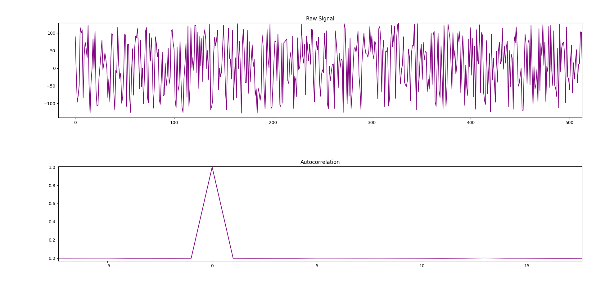

# WAV-RNG

**Note: This project is a work-in-progress. The random number generator in this project should not be used for security or cryptographic purposes.**

## Introduction
Generating truly random numbers is hard. By definition, computers cannot generate random numbers since they are deterministic. Instead, computers can generate *pseudorandom* numbers. Pseudorandom number generators (PRNGs) use algorithms that take a seed, or starting value, and generate sequences of numbers that approximate the (statistical) properties of sequences of random numbers. Some of these are quite good, and are used for cryptographic purposes, but they cannot be said to be *true* random number generators (TRNGs, or just RNGs). 

While PRNGs generate sequences of numbers that look random, but are in fact predetermined by the algorithm and seed, RNGs generate random numbers based on physical phenomena that are expected to be random. Examples of such physical phenomena include atmospheric noise, thermal noise, and radioactive decay. In this project, we will use the former as a basis of our random number generator. Specifically, this project includes Python code that generates random numbers, in a variety of different formats, from .wav files containing recorded atmospheric noise. A driver script `rng.py` allows users to easily generate random numbers from recorded atmospheric noise in a variety of different formats.

The rest of this document is broken up into four sections. In the first, I give an overview of how to use the RNG driver program, `rng.py`, to generate random numbers from .wav files containing recorded atmospheric noise. Next, I describe the methodology for the RNG in more detail. In the third section, I discuss the testing of the RNG. Finally, I end with some concluding remarks and areas of future improvement.

## Using `rng.py`
(In addition to this section, this information is available in a more condensed form which you can access by running `python3 rng.py -h`. )

Running the `rng.py` script to generate random numbers is very simple. For the most basic usage, you can run `python3 rng.py --in <input.wav>` for any input .wav file. This will print out, as a Python `bytearray`, all the random bytes generated by the .wav file. For a more readable format, you can choose from the `--ascii`, `--binary`, `--hex`, or `--digits` options to get the data in the specified formats. See examples below:

`$ python3 rng.py --in noise.wav --ascii`
output: `CfqGbj[LMa^{lK[{AA`

`$ python3 rng.py --in noise.wav --digits`
output: `60072664111942976`.

To write output to a file, you can run with the `--out` option, followed by a filename:
`$ python3 rng.py --in noise.wav --digits --out random_digits.txt`

The same can be done with any format, including raw bytes, which is the default mode of output. This will produce a raw binary file with the generated data.

Often times, a user may have a large .wav file, but may want only a portion of the random data in can generate. Firstly, to check how much random data a .wav file can generate, run,
`$python3 rng.py --in noise.wav -q`.
This runs the "query" function, which will return how many available bytes can be generated, with output: `total available bytes for noise.wav with bpb=16: 8975839`.

This tells us that our file `noise.wav` can generate about 9MB of random data. (Don't worry about the "bpb" part yet. More on that below). 

Now, suppose we want only a fraction of those raw bytes. We can specify the starting and ending bytes to print with the `-s` and `-e` flags. Start is inclusive, while end is exclusive. In mathematical notation, the range: [start, end). Without specifying either, the start position defaults to zero, and the end position defaults to the maximum given the file-size:
`$python3 rng.py --in noise.wav -s 10 -e 14 --hex`
output: `a06b1aa4`. (Note that only four bytes, in the form of hexadecimal digits, were printed out).

The above examples conclude the most basic functionality of the RNG. For the remaining steps, we will have to dive into the more technical aspects of how the random number generation happens. For a full description of the technical details, see the [Methodology and Technical Details](methodology-and-technical-details) section. But for now I will go over the basics in order to demonstrate the other options for `rng.py`

### -bpb: `bits_per_block`
The full technical details of the RNG are described in the next section, but for the sake of this section, the `bits_per_block` variable dictates how many bits make up a larger "block" in the .wav file. Instead of taking all the data from the .wav file and passing it off as random data, only one bit per each block of .wav data is selected to be output in the stream of generated random data. The default value of `bits_per_block=16` is probably sufficient unless you're interested enough to mess around with it yourself, but users can specify any positive multiple of 16, e.g. `-bpb 32`.

### -u: `use_bit`
This variable dictates which bit, within each block of .wav data, should be used. The default value is set to `None`, which means that all bits in each block will be XOR-ed together. Alternatively, the user could use `0`, as .wav data is stored in little-endian, and therefore the least significant bit will be used. The value must be a non-negative integer less than the `bits_per_block` field. The default value of `None` should be sufficient for most purposes.

### Combining with pseudorandom data
`rng.py` provides the option of combining the random data generated from the .wav file with pseudorandom data from different sources. The two sources that are currently supported are the Python secrets module, with associated flag `--secrets` and pseudorandom data generated from grc.com/passwords.htm (Gibson Research Corporation) with `--grc`. Additionally, both can be selected, and all three sources of (pseudo)randomness will be used. The method of combining the random data is with the XOR function, which is discussed in more detail in the next section. Also note that, when using `--grc`, a maximum of 32 bytes can be requested, as getting larger amounts of data would require spam-requesting the site which I do not want to encourage. Examples:

`$ python3 rng.py --in noise.wav -s 0 -e 6 --secrets --hex`
output: `ae2f0ae08656`

Also, you can choose to run `rng.py` without a .wav file at all (although this kind of defeats the purpose of this project...), which will return random data from one of the supported PRNGs. When doing this, however, you will need to specify the number of bytes, and you will have to choose the secrets and/or grc modes:

`$python3 rng.py --secrets --num_bytes 10 --digits`.

### Extracting randomness with hash functions

This option was inspired by [reallyreallyrandom](http://www.reallyreallyrandom.com/golden-rules/extract/), a project on TRNGs. The general idea is that [hash functions](https://en.wikipedia.org/wiki/Hash_function) serve as good randomness extractors. As will be discussed in the next section, the waveform of atmospheric noise does not take on the form of randomness we are looking for, in which each bit is 1 or 0 with .5 probability. The waveform does, however, contain entropy, which can be used in conjunction with a randomness extractor to generate [i.i.d.](https://en.wikipedia.org/wiki/Independent_and_identically_distributed_random_variables) samples, which is what we want.

Adding the `--extract` flag will use the SHA256 hash function to extract 256 random bits from every 512 bits of processed .wav data. Thus, the user will get half as much data if they use this option. 

Using this option does not seem strictly necessary, considering the [testing](#testing) I've done on the regular .wav RNG, although many recommend it as good practice for TRNGs. 

## Methodology and Technical Details
### Intuition
The methodology for this RNG is greatly inspired by Jeremy Triplett in his [medium post](https://jeremytriplett06.medium.com/using-atmospheric-noise-to-generate-true-random-numbers-dc820ac9452d) on the topic. As such, anyone who is interested in my methodology should read his overview. Additionally, his provided links to information about the [WAV](http://soundfile.sapp.org/doc/WaveFormat/) file format will be useful to anyone pursuing a similar project, or just trying to understand the details here. Another resource worth mentioning is random.org, a site that provides random data generated by atmospheric noise free of charge (up to a point). The site also has plenty of good reading material about randomness and the statistics of it all.

The basic idea behind the RNG is this: the waveform of [atmospheric noise](https://en.wikipedia.org/wiki/Atmospheric_noise), which is after all radio noise caused by natural atmospheric processes, should be random. The way that this waveform is captured in a .wav file is by a series of 16-bit samples. Basically, the data of a .wav file is a series of 16-bit numbers that describe the wave at different points in time. 

You might think that since the waveform of atmospheric noise looks pretty random, and the .wav data essentially captures that waveform in a series of 16-bit integers, we can just take all the data in the .wav file and pass it off as random. This is problematic, however, because the values of the waveform at each point in time aren't [independent and identically distributed](https://en.wikipedia.org/wiki/Independent_and_identically_distributed_random_variables) (i.i.d. for short) data that we are looking for. They do contain entropy, however. (Another problem is the fact that .wav files have a 44-byte header, but this is easily remedied by simply skipping over those bytes).

To understand this, consider an example. Suppose we are measuring some sort of physical quantity over time. At a certain time, `t_0`, the quantity takes on the value 7378267 units. Over a short period of time, until, say `t_1`, we expect the quantity to vary randomly in some direction, but the magnitude of that variation might not be very big. As an example, for a series of times, we might measure 7378382 units, then 7412868, then, 7351467, and so on. The variation from each sample to the next seems random, and yet the numbers taken in their entirety don't—namely because they don't vary enough to change the most significant digit (7), and hardly the second most significant digit (it changed from 3 to 4 and back to 3). 

The same concept applies with the waveform of our atmospheric noise. The most significant digit in the binary encoding is not likely to change very much (and therefore, not a very good source of randomness) from sample to sample. The least significant digit, however, we can assume to be quite random, since the variation from one sample to the next dwarfs the magnitude of the least significant bit (which takes on a maximum value of 1 in binary). Therefore, from each 16-bit sample, we will only grab the least significant bit and add it to our randomly generated sample. We can also think of this least significant bit as an indicator of whether the waveform is even or odd at a given point in time. Since we are dealing with such large magnitudes (16 bits gives a total magnitude of 2^16, which is over 60,000), whether the integer representation of the waveform at a given point in time is even or odd should be random.

A more formal way of putting the above is that the raw bytes from the .wav file will be highly [autocorrelated](https://en.wikipedia.org/wiki/Autocorrelation). This means that subsequent values will depend on each other, which is undesirable, since we're after i.i.d. data in which one byte tells us nothing about the next, or the next, or the next ...

To see this, take a look at the below figure. The top portion plots the raw signal over time. As you can see, the values are clumped together: several values appear very close together, then a large dip occurs, then the pattern repeats. This makes sense: after all, we are measuring the shape of a wave which, despite having random variations in it, still behaves like a wave. The bottom portion gives the autocorrelation of the signal. The x-axis corresponds to the difference in time/index of the signal (i.e., x=2 means we are looking at signals that are two points apart, x=3 means we are looking at signals that are three points apart, etc.), and the y-axis corresponds to how correlated those signals are. For perfectly random i.i.d. data, we should have a spike at zero, since each point is always identical to itself, and an autocorrelation value very close to zero everywhere else. Instead we see spikes at 2, 4, 6, and 8. This means that bytes that are 2, 4, 6, or 8 places apart in the raw .wav file are rather highly correlated; knowing what value a given byte is tells us something about what the byte two bytes after it will be, and so on. This actually makes perfect sense if we recall how .wav files are encoded: the values of the waveform are represented by 16-bit integers, i.e. 2-byte integers. We see a spike at these even numbers because as we can see in the top portion of the figure, each integer tends to be pretty similar to the next few. 


*Raw .wav data. Credit to reallyreallyrandom.com for the code for these plots*

There are multiple ways of remedying this, but for the time being I'ce chosen to use the strategy outlined above: namely, select the least significant bit from each 16-bit block, and consider that to be a randomly generated bit (in other words, i.i.d. like we want). The below figure shows the raw signal and the autocorrelation for the processed .wav data with this method. If we compare the raw signal of the .wav data and the processed data, we see a clear difference. In the above .wav data, we see the signal behave more like a wave, with values clumped together as a wave tends to behave. In the processed data, this behavior is gone, and the points just look randomly placed.

Further, looking at the autocorrelation of the processed data, we see that there is no detectable autocorrelation, except at x=0, which is to be expected. This means we've succesfully de-correlated our raw data. As input, we took in highly correlated data, in which raw bytes that are close to each other in the file take on similar values. After processing, this trend disappears, and one byte no longer tells us any information about subsequent bytes.


*Processed .wav data. Credit to reallyreallyrandom.com for the code for these plots*

### `bits_per_block` and `use_bit`

This is where the `bits_per_block` variable mentioned earlier in this document fits in. The default value is set to 16 bits, which means that one bit per every 16-bit integer in the .wav file is taken as a random bit. Users can specify a larger value for this variable, as long as it is a multiple of 16, to essentially skip over different blocks. For example, setting `-bpb 32` sets the `bits_per_block` variable to 32, which means that now we are only extracting one random bit from every *two* 16-bit integers in the .wav file. As mentioned earlier, if the `use_bit` variable is not set, all of these 32 bits will be XOR-ed together to produce our random bit. If a value between 0 and 32—i.e., [0, 32)—is chosen, then that bit will be used in every group of 32 bits in the .wav file. Therefore, setting `-bpb 32 -u 0` would use the 0th bit of *every other* 16-bit integer in the .wav file as a random bit.

### The *Exclusive or* operation
[Exclusive or](https://en.wikipedia.org/wiki/Exclusive_or), or XOR, is a logical operation that we can perform on two bits, or strings of bits of any length. Interested readers should take a look at the linked Wikipedia page for more details, but basically, the XOR of two bits is 1 if and only if the bits differ. That is, if two bits `a` and `b` are the same (both 0 or both 1), the XOR of `a` and `b` is 0; if they are different (one is 1 and the other is 0), their XOR is 1. 

This logical operation is relevant for us because it has some useful properties when it comes to randomness. Namely, the XOR operation preserves randomness. This means that, if I have a string of random bits (that is, generated from a random process, such that each bit is 1 with probability 0.5 and 0 with probability 0.5), and I XOR that string of bits with *any* (statistically independent) string of bits of the same length, the resulting string of bits will also be random. XOR is quite a powerful tool then: even if I XOR a string of random bits with a completely deterministic and non-random string of bits (say 11111..., i.e. a string which entirely consists of 1s), the result will still be random! There is one caveat that I mentioned above, which is that the two strings must be statistically independent, i.e., their probability distributions cannot depend on one another. Luckily, the way we are using XOR in this project adheres to this requirement.

In the previous section I talk about the `--secrets` and `--grc` options which allow the user to combine the random bits generated from the .wav file with pseudorandom bits generated in the Python secrets module and GRC's PRNG. The reason I provide this option is to increase the robustness of the RNG overall. Consider the idea that we may not be completely sure that the bits generated from the .wav files are entirely random. Perhaps the frequency we are tuning to during the recording process has a faint signal that has a pattern to it. Or perhaps the way that the waveform is being written to the .wav file has some properties that causes some patterns of bits to be more likely than others. In most instances this seems unlikely given the testing I have done on the .wav portion of the RNG, which I describe in more detail in the [next section](#testing), but it is always a possibility. The option of combining the random data from the .wav portion of the RNG with other sources of pseudorandom data is a way to counter this possibility. 

As I mentioned, as long as two strings of bits are statistically independent—and here it is safe to say that the .wav data, the output of the Python secrets module, and the output of the GRC PRNG are mutually independent, satisfying this requirement—XOR-ing these bit strings together cannot eliminate any randomness that either of the bit strings already contained. In other words, if we XOR random data generated from the .wav file with pseudorandom data generated from the Python secrets module, the output will still be "just as random" as the data from the .wav file. I put "just as random" in quotes because talking about *how random* something is perhaps requires more mathematically robust language than is being used here, but the overall principle holds.

So the gist of it is, XOR-ing the random output from the .wav file with pseudorandom data from the Python secrets module (which Python claims is a cryptographically-secure pseudorandom generator (CSPRNG)) cannot "downgrade" the randomness of the data. It can only upgrade it in the event that the .wav portion of the RNG isn't functioning properly and is not working as a proper RNG. In this instance, we would be XOR-ing non-random data from the .wav generator with pseudrandom data from Python's secrets module, and we would essentially have a PRNG. So users can view this option as a sort of fail-safe against the hard-to-eliminate possibility that the .wav RNG has some imperfections. 

## Testing

### Statistics and Intuition

(If you're just interested in seeing the test results, you can skip to the next subection. In this subsection I try to give an overview of how these randomness tests work, and what testing for randomness really means in the first place.)

Due to the many uses of random numbers—and some of them with serious consequences, as in cryptography—a great deal of effort has gone into testing candidate (pseudo)random number generators. There are different ways to test RNGs, but they typically share the same general strategy:
- treat the output of candidate RNGs as streams of random numbers
- Compute various [test statistics](https://en.wikipedia.org/wiki/Test_statistic) on the data
- If the test statistics are sufficiently unlikely, we can reject the null hypothesis that the data was generated from a random process. Otherwise, we fail to reject the null hypothesis, and have failed to prove that the data is not random.

Essentially what I am describing is [hypothesis testing](https://en.wikipedia.org/wiki/Statistical_hypothesis_testing) with the use of [p-values](https://en.wikipedia.org/wiki/P-value). These topics are quite involved—especially p-values, of which there are many [misconceptions](https://en.wikipedia.org/wiki/Misuse_of_p-values), so much so that the American Statistical Association released a [statement](https://www.tandfonline.com/doi/full/10.1080/00031305.2016.1154108) on it—so interested readers should do their own reading on the topic. (The linked Wikipedia pages are a good place to start). To illustrate the concept more concretely, I'll give an example.

Suppose I give you a coin which I allege is a fair coin, with a 50% chance of heads and 50% chance of tails. Skeptical of my claim, you decide to test it out, and begin flipping the coin repeatedly while keeping track of the outcomes. But what exactly would you be looking for to prove the coin is fair, or not fair? One idea comes to mind: keep track of the number of heads and tails after many coin flips. If the numbers are pretty equal, then you can accept my claim that the coin is fair. If the numbers have a large discrepancy, then you could cite that as proof that the coin is unfair. 

For example, suppose you flip the coin 1,000 times with a total of 497 heads and 503 tails. This seems well within the realm of possibility, and so you accept my claim that the coin is fair. If, however, you got a total of 300 heads and 700 tails, you might think the results seem off, and the coin is unfair. You might go a step further and calculate the probability of getting 300 heads and 700 tails with a fair coin. To formalize this, in hypothesis testing we would really want the probability of getting a result *at least as extreme* as this result, and this would be our p-value. In this instance, with a fair 50/50 coin, the probability of getting a result *at least as extreme* as 300 heads and 700 tails corresponds to the probability of getting 300 or less heads out of 1,000 trials. This probability is surprisingly small: less than one in a million. (The probability follows the [binomial distribution](https://en.wikipedia.org/wiki/Binomial_distribution), and you can calculate these types of probabilities with a binomial calculator like [this](https://stattrek.com/online-calculator/binomial.aspx)). In formal hypothesis testing language, then, our p-value would be 0.000001, which is the probability of getting a result at least as extreme as the one we observed, *under the null hypothesis*. The null hypothesis just means what we assumed at the beginning: that the data were random. With the probability being so low, below some threshold that we would designate at the start of the experiment (0.05, 0.01, and other thresholds are commonly used), we may reject the null hypothesis, i.e., conclude that the data is not random.

To summarize, given data that was generated by a candidate RNG, we can calculate a test statistic on this data (in our example, simply the numbers of heads and tails). Then we can calculate how likely it is to observe a test statistic at least as extreme as the one we observed (in our case, the probability of getting 300 or less heads out of 1,000 flips), assuming that it is indeed random. If it is sufficiently unlikely (like how getting only 300 heads in 1,000 flips has less than one in a million chance) we can reject the null hypothesis and conclude that the data is not random. Otherwise, we fail to reject the null hypothesis and we cannot claim the data is not random.

Notice that when we fail to reject the null hypothesis, we aren't concluding that the data is random. Instead, we simply say that we failed to prove that it's *not* random. Even when we reject the hypothesis, we do not really "prove" that the data was not random. In fact, all our test statistic tells us is how likely we are to observe an outcome at least as extreme as the one we observed if the data were truly random. It is worth remembering that if we continue to flip a truly fair coin over and over again, we will see even the most unlikely outcomes of such a process: even 300 heads and 700 tails in a string of 1,000 flips. (In fact, we can make an even stronger claim than this: the [infinite monkey theorem](https://en.wikipedia.org/wiki/Infinite_monkey_theorem) tells us that in an infinite series of fair coin flips, every possible string of outcomes would occur an infinite amount of times, with probability 1). 

Thus, it is important to remember that no statistical test can tell us definitively whether a RNG is really random or not. The best they can do is subject the outcomes of RNGs to statistical tests and reject or fail to reject the null hypothesis based on a p-value threshold which is, ultimately, somewhat [arbitrary](https://www.tandfonline.com/doi/full/10.1080/00031305.2016.1154108). Nonetheless, these statistical tests can be powerful tools that can help us identify poorly working (P)RNGs, or give us more confidence that our RNG is working properly.

To test this RNG, I picked out three popular testing suites for (P)RNGs and applied them to data generated by the RNG. Two of the three follow this type of hypothesis testing framework. Like the coin flipping example, they calculate test statistics and give a PASS/FAIL rating based on a p-value threshold. Instead of simply summing the numbers of head and tails, however, the statistical tests done in these suites are much more complicated, in an attempt to trip up poorly working (P)RNGs. The other test suite is a much simpler one and does not use p-values. It serves more as a sanity check to on data generated by a candidate RNG.


### ENT: Pseudorandom Number Sequence Test Program
In this section I apply the [ent](https://www.fourmilab.ch/random/) sequencing program on data generated by the .wav RNG. This testing program is not as rigorous as the NIST suite, and is not based on hypothesis testing or p-values. Instead, it outputs a brief summary of various test statistics and makes no adjudication on whether the data seems randomly generated or not.

I used the ent program on several 1MB files generated by the .wav RNG. The full results are available in `results/ent/`, and an example of one output is below:

```
Entropy = 7.999820 bits per byte.

Optimum compression would reduce the size
of this 1000000 byte file by 0 percent.

Chi square distribution for 1000000 samples is 250.05, and randomly
would exceed this value 57.57 percent of the times.

Arithmetic mean value of data bytes is 127.5314 (127.5 = random).
Monte Carlo value for Pi is 3.139788559 (error 0.06 percent).
Serial correlation coefficient is -0.000203 (totally uncorrelated = 0.0).
```

Most of the other ent results look similar. A full description of the fields of the test is available at the linked site, but briefly: 
- entropy gives the information density of the file. A perfect score is 8 bits per byte, and the 7.999820 is quite close.
- Optimum compression gives how much the file could be compressed. Random data should not be able to be compressed at all, normally, since there should be very little detectable pattern in the data. The above result indicates 0% compression is possible, which is a perfect score. 
- The Chi squared test statistic is, according to the authors, "extremely sensitive to errors in pseudorandom sequence generators ... If the percentage is greater than 99% or less than 1%, the sequence is almost certainly not random..." In short, extreme values indicate non-randomness, so a score of 58% is good.
- Arithmetic mean is simply the result of summing the bytes and computing an average. The [law of large numbers](https://en.wikipedia.org/wiki/Law_of_large_numbers) tells us that for large sequences of random numbers, this statistic should converge to the true mean, in this case 127.5. Scores close to this value are to be expected, whereas scores that stray far from this value could indicate non-randomness.
- The Monte Carlo value for Pi section uses the data to approximate Pi via the [Monte Carlo method](https://en.wikipedia.org/wiki/Monte_Carlo_method). If a large sequence of data has a very inaccurate Monte Carlo approximation it is an indication that the data is not random. Our small error of 0.06% is well within the expected value of random data.
- Serial correlation tells us how much subsequent bytes depend on each other. For random data, this should be very close to zero.

As I mentioned, this is not a very rigorous test, but can serve as a sanity check that our generator is performing decently.


### Nist Randomness Test Suite
In this section I discuss the results of NIST's *A Statistical Test Suite for Random and Pseudorandom Number Generators for Cryptographic Applications* applied to the output of my RNG. You can find the official posting of this project by NIST [here](https://www.nist.gov/publications/statistical-test-suite-random-and-pseudorandom-number-generators-cryptographic), which has a link to download the PDF of their document. For this project I used [this](https://github.com/stevenang/randomness_testsuite) implementation of the NIST test suite by Steven Kho Ang and Spence Churchill.

Readers who are interested in the testing of RNGs should take a look at NIST's own document, or do some googling about it. But the gist of the tests is rather simple. They use a hypothesis testing approach, with p-values. In each test, the data is treated as if it were random (i.e., the null hypothesis is that the data is random). Then, various test statistics are computed based on that data, and if the resulting p-value is sufficiently low, the null hypothesis is rejected and the data is deemed "non-random." This is a slight oversimplification, but the overall principle is true: treat the data as if it were random, and if the results are sufficiently unlikely, the null hypothesis is rejected and the data is deemed non-random.

To test the .wav portion of the RNG for the dieharder tests ([next section](#dieharder-tests)), I needed a large file (at least 1GB). However, the implementation of the NIST test suite I am using does not handle files that large, so I split that file into ten pieces and tested them separately. This has the additional advantage of allowing me to get many different p-values from the tests. Each test has 41 p-values, and multiplied by the ten files gives a total of 410 p-values. This way a pass/fail rates can be obtained, and the distributions of p-values can be plotted, and compared to the ideal [uniform distribution](https://en.wikipedia.org/wiki/Continuous_uniform_distribution) over [0,1) that the p-values would take on if the data was truly random.

**For the `use_bit=None` setting, out of the 410 tests, 405 tests passed, while 5 tests failed. This is a 98.78% success rate**. The decision rule used for the NIST test suite is to reject the null hypothesis that the data are random if the p-value is less than 0.01, i.e. 1%. Therefore, a "perfect" RNG would, over time, fail at a rate of exactly 1%. Thus, a 98.78% success rate—or in other words, a 1.22% fail rate—is very close to that of an ideal random number generator. Thus, the number of test failures does not indicate that the data are not random.

In addition to a fail rate that deviates from the expected (in this case, 1%) rate, another indication that the test data were not generated by a random process is if the distribution of p-values deviates significantly from the [uniform distribution](https://en.wikipedia.org/wiki/Continuous_uniform_distribution) over the interval [0,1). Below is a histogram of the p-values for the `use_bit=None` mode of the .wav RNG. If the data were not generated by a random process, we might expect to see a distribution that deviates significantly from the uniform distribution, e.g. more p-values closer to the extreme ends of 0 and 1. However, the distribution of p-values seen below is quite similar to the uniform distribution, and certainly does not deviate enough to indicate non-randomness.


**For the `use_bit=0` setting, 408 out of 410 tests passed. This is a 99.51% success rate.** As with the `use_bit=None` case, this is very close to the expected success rate of 99% for a perfect RNG. Below is a histogram of the p-values for the `use_bit=0`, which is quite close to the expected uniform distribution.


Overall, with both `use_bit=0` and `use_bit=None`, the fail-rate of the RNG was very close to the expected fail rate of 1% for an ideal generator. Furthermore, the distributions of p-values did not deviate significantly from the expected uniform distribution. Therefore, the statistical tests in this suite did not provide evidence that the data was not random.

### Dieharder Tests

The [dieharder](https://webhome.phy.duke.edu/~rgb/General/dieharder.php) random number test suite is the most stringent of the three test suites I've applied to the .wav RNG. It follows the hypothesis testing/p-values paradigm, and for each of its 114 tests a result of PASSED, WEAK, or FAILURE is given, along with a p-value. The creator of the tests write that "dieharder is a tool designed to permit one to push a weak generator to unambiguous failure (at the e.g. 0.0001% level), not leave one in the "limbo" of 1% or 5% maybe-failure." As such, very low p-values are required for a result of FAILURE, and one or more failures can be seen as a strong indication that the data were not generated by a random process.

However, there is one complication that I faced with the dieharder tests. The dieharder tests are ideally run with a RNG that can output a stream of data from which dieharder can draw from. If the user chooses to use files of data generated by a candidate RNG instead, they should be large files, but how large, [no one really knows](https://crypto.stackexchange.com/questions/90076/how-to-compute-the-dataset-size-required-by-dieharder-tests). It is suggested that the file be at least 4GB, else it will be "rewound," presumably reusing parts of the random data and resulting in faulty outputs. As the dieharder manpage notes: "a file that is too small will 'rewind' and render the test results where a rewind occurs suspect." In fact, running the dieharder tests on smaller files (around 1MB or even 10MB) causes numerous failures, at very low p-value thresholds, in even the best state-of-the-art generators. If the test results are taken at face value, multiple failures give a strong indication that the data were not generated by a random process. But when smaller files are used, it is much more likely that the "rewinding" of the file during the tests is the cause of these failures, especially if other tests that do not rewind the file are PASSED.

This .wav RNG relies on large amounts of data via recorded atmospheric noise. (Recall too that, since we only take one bit from every 16 bits of atmospheric noise data, we need a 16GB file of recorded atmospheric noise to generated 1GB of random data). As such, I have only generated 1GB of random data thus far. Because of this, the results from the dieharder tests should be taken with a grain of salt. For the dieharder tests on the files I generated, many of the tests rewound the data upwards of ten times, some even hundreds of times. This is not ideal, but will have to suffice until I generate larger files.

Below is the summary of the the dieharder test results for the .wav RNG using `use_bit` values of `0` and `None` in the first two columns, and the Python secrets module in the third column. All tests were done on files of 1GB generated by their respective RNGs. The `use_bit=0` .wav RNG performed very well, with results comparable to those of the Python secrets module—which is itself a cryptographically secure PRNG—and other "gold standard" generators such as the AES_OFB included in the dieharder suite as a reference. The latter test consistently returned WEAK test results in about 3-5 of the 114 tests, so the 3 WEAK test of the .wav RNG are in line with a good RNG.


| Test Score | `use_bit=0` WAV-RNG | `use_bit=None` WAV-RNG| Python secrets |
| ----------- | -------------------- | ---------------------- | ------------- |
| PASSED |  111 | 107 | 109 |
| WEAK | 3      | 5 | 5 |
| FAILED | 0    | 2 | 0 |


The `use_bit=None` .wav RNG performed worse, with five WEAK results and two FAILED results. The two FAILED results are a strong indication that the data tested by the dieharder tests was not generated by a random process. However, because of the file rewinding, this does not necessarily mean that there is a strong indication that the 1GB of data generated by the .wav RNG was not random; it could be that the file "rewinding" contributed to the FAILED tests. Until larger data files are obtained to test on, it is difficult to draw any firm conclusions from these tests.

### NIST 800-90B IID tests
I applied [this](https://github.com/usnistgov/SP800-90B_EntropyAssessment) implementation of [NIST 800-90B, *Recommendation for the Entropy Sources Used for Random Bit Generation*](https://nvlpubs.nist.gov/nistpubs/SpecialPublications/NIST.SP.800-90B.pdf) to the data generated by the RNG, in particular the i.i.d. tests which test whether the data are i.i.d. random. The generator passed all tests. Here is a sample output:

```
H_original: 7.929300
H_bitstring: 0.999108
min(H_original, 8 X H_bitstring): 7.929300
** Passed chi square tests

** Passed length of longest repeated substring test

** Passed IID permutation tests
```

### Reallyreallyrandom IID Tests

I applied [reallyreallyrandom's](http://www.reallyreallyrandom.com/golden-rules/our_tests/) IID tests to data generated from the .wav RNG. I applied their fast- and slow- IID tests to files approximately 5MB in size, and all tests were passed. Interested readers should read their detailed documentation of the tests on the above link.

For the slow IID test, a summary output was given: `*** PASSED permutation test. There is no evidence that the data is not IID ***`, which it concluded based on 466 permutation tests. A plot of the test statistics is shown below, which has the expected shape.


*Test statistics for the ordered permutations tests in the slow-IID test. Passing result*

For the fast IID test, they also do an ordered permutations test, and the result had a summary:
```
Broke file into 524,287 byte segments.
Tested 5,242,870 bytes for each compressor.
Using 3 compressors.
Minimum NTS = 0.9998785864426587
Maximum NTS = 1.0002466694875536
Mean NTS = 0.999999368683967
66.7% unchanged by shuffle.
Probability of 15 heads and 15 tails = 1.0000


*** Accept Ho. The data file looks like IID ***
```
This indiates a passing result.


*Test statistics, and p-value (essentially) for ordered permutations tests in the fast-IID test. Passing result*

### Testing: Conclusion

Several popular randomness test suites were used to test the .wav RNG. The results of all tests are available in the `results/` directory and have been discussed in this section. The test suites range from not very rigorous (like ent) to super rigorous (like dieharder). Most of the tests are in the middle, for example the various NIST tests used and the Reallyreallyrandom tests. It is important to keep in mind that these types of statistical tests cannot "prove" that data is random. Nor can they really do the converse and prove that data is not random. What they can do is give strong indications that data are not random, and if many tests fail to do this, we gain confidence in the effectiveness of our RNG.

Of all the tests applied, none of them except for the dieharder tests gave any indication that the data was not random. But the dieharder tests have reliability issues because of the large size requirements that were discussed earlier. Generating enough random data to meet those requirements is not something I have done yet, so the tests were conducted on a smaller than ideal data file. This, according to the creators of the dieharder tests, could render the results "suspect," and all other tests considered, it appears this may be the case. Afterall, I had tested Python's secrets module—a cryptographically secure PRNG—with a file of the size that resulted in a failure for the .wav RNG, and it had also failed on at least one occasion. This indicates—along with the creators' other warnings—that failures on random data for files of that size are likely caused by the small filesize.

Verifying that a RNG is truly random is not something one can do with 100% certainty. In the words of the creators of the dieharder tests, "perfect random number generators produce 'unlikely' sequences of random numbers—at exactly the right average rate. Testing a rng is therefore quite subtle." The best we can do is subject RNGs to statistical tests in an attempt to produce evidence that indicates that candidate generators are not perfectly random, and the lack of said evidence is not proof that the candidate generator is random. Individuals must then interpret these results and come to their own conclusions. In the future, I would like to continue testing the RNG on larger sets of data, which might produce more definitive results.
