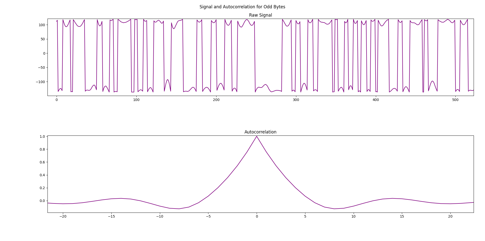
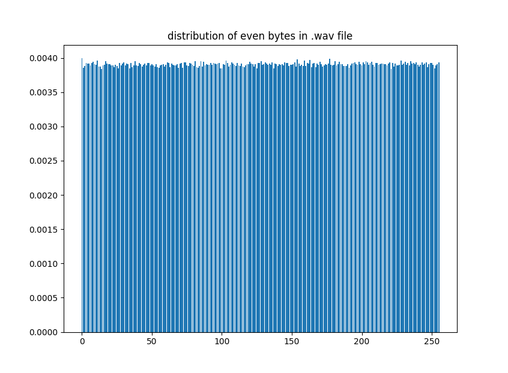

# Technical Details of the RNG

## Methodology and Intuition

### Intuition
The methodology for this RNG is inspired by Jeremy Triplett in his [medium post](https://jeremytriplett06.medium.com/using-atmospheric-noise-to-generate-true-random-numbers-dc820ac9452d) on the topic. As such, anyone who is interested in my methodology should read his overview. Additionally, his provided links to information about the [WAV](http://soundfile.sapp.org/doc/WaveFormat/) file format will be useful to anyone pursuing a similar project, or just trying to understand the details here. Another big help was [reallyreallyrandom](http://www.reallyreallyrandom.com/), which has a thorough overview on DIY RNG's like this one, and goes into some of the more technical/math details. Finally, random.org is a site that provides random data generated by atmospheric noise free of charge (up to a point). The site also has plenty of good reading material about randomness and the statistics of it all.

The basic idea behind the RNG is this: the waveform of [atmospheric noise](https://en.wikipedia.org/wiki/Atmospheric_noise), which is after all radio noise caused by natural atmospheric processes, should be random. The way that this waveform is captured in a .wav file is by a series of 16-bit samples. Basically, the data of a .wav file is a series of 16-bit numbers that describe the wave at different points in time, and these numbers should have some randomness in them. But first we must clarify what we mean when we say the waveform has some "randomness" in it, and how it can help us generate random numbers.


*The top is the plot of the raw integer-values of the signal, zoomed in to capture at a resolution of less than a tenth of a second. The bottom is a histogram of the raw integer-values of the signal.*


### Extracting Randomness from Entropy

You might think that since the waveform of atmospheric noise looks pretty random, and the .wav data essentially captures that waveform in a series of 16-bit integers, we can just take all the data in the .wav file and pass it off as random. This is problematic, however, because the values of the waveform at each point in time aren't [independent and identically distributed](https://en.wikipedia.org/wiki/Independent_and_identically_distributed_random_variables) (i.i.d. for short) data that we are looking for. They do contain [entropy](https://en.wikipedia.org/wiki/Entropy_(information_theory)), however. (Another problem is the fact that .wav files have a 44-byte header, but this is easily remedied by simply skipping over those bytes).

More specifically, the type of randomness we are after is a special kind of i.i.d. data. The two "i's" here are important. The first, *independent*, means that each value should not depend on any other value. The second, *identically*, means that all the data share the same [probability distribution](https://en.wikipedia.org/wiki/Probability_distribution). Basically, when we generate bits, we want each bit to be independent of all the other bits (they don't depend on each other), and we want them to all share the same probability distribution—in this case, the [Bernoulli distribution](https://en.wikipedia.org/wiki/Bernoulli_distribution) with paramater *p = 0.5*. This distribution is a fancy way of describing an example we're all familiar with: a fair coin that lands on heads 50% of the time and tails 50% of the time, such that no coin flip depends on other coin flips. When we consider multiple bits—for example, bytes, which are composed of eight bits—the equivalent distribution is the [discrete uniform distribution](https://en.wikipedia.org/wiki/Discrete_uniform_distribution). This just means that, of all the possible 256 values a byte can take on, we expect to see each of them with equal probability. From this point on, when I refer to our target distribution that we aim to generate from, I am referring to these two which essentially amount to the same thing: every outcome (0 or 1 for bits; and all the possible 256 values for bytes) should occur with equal probability, and no two distinct outcomes should be dependent on each other.

But unfortunately for us, the waveform of atmospheric noise does not directly give us this type of i.i.d. data. To understand why, consider an example. Suppose we are measuring some sort of physical quantity over time. At a certain time, the quantity takes on the value 7378267 units. Over a short period of time, we expect the quantity to vary randomly in some direction, but the magnitude of that variation might not be very big. As an example, for a series of times, we might measure 7378382 units, then 7412868, then, 7351467, then 7382842 and so on. The variation from each sample to the next seems random, and yet the numbers taken in their entirety don't—namely because they don't vary enough to change the most significant digit (7), and hardly the second most significant digit (it changes from 3 to 4 but that's it). 

The same concept applies with the waveform of our atmospheric noise. A more formal way of putting the above is that the raw bytes from the .wav file will be highly [autocorrelated](https://en.wikipedia.org/wiki/Autocorrelation). This means that subsequent values will depend on each other, which is undesirable, since we're after i.i.d. data in which one byte tells us nothing about the next, or the next, or the next ...

To see this, take a look at the below figure. The top portion plots the raw byte values of the .wav file over time. (This is not exactly the same as plotting the raw signal, for which we would have to plot the 2-byte integers, but it still gives us a good picture as to what's happening). As you can see, the values are clumped together: several values appear very close together, then a large dip occurs, then the pattern repeats. This makes sense: after all, we are measuring the shape of a wave which, despite having random variations in it, still behaves like a wave. The bottom portion gives the autocorrelation of the signal. The x-axis corresponds to the difference in time/index of the signal (i.e., x=2 means we are looking at .wav bytes that are two bytes apart, x=3 means we are looking at byte values that are three bytes apart, etc.), and the y-axis corresponds to how correlated those signals are. For perfectly random i.i.d. data, we should have a spike at zero, since each point is always identical to itself, and an autocorrelation value very close to zero everywhere else. Instead we see spikes at 2, 4, 6, and 8. This means that bytes that are 2, 4, 6, or 8 places apart in the raw .wav file are rather highly correlated; knowing what value a given byte is tells us something about what the byte two bytes after it will be, and so on. This actually makes perfect sense if we recall how .wav files are encoded: the values of the waveform are represented by 16-bit integers, i.e. 2-byte integers. We see a spike at these even numbers because as we can see in the top portion of the figure, each integer tends to be pretty similar to the next few. 


*Raw .wav data. Credit to reallyreallyrandom.com for the code for these plots*

What we have then, in our waveform, is not i.i.d. randomness but [entropy](https://en.wikipedia.org/wiki/Entropy). The key question is, how do we extract i.i.d. randomness from this entropy source? One idea is that we might look at the upper and lower bytes of the 16-bit (2-byte) integers separately. The odd numbered bytes will be the more significant byte in each integer, and are likely to not vary much from sample to sample; while the even numbered bytes will be the less significant bytes and might contain more randomness. To test this hypothesis, I plotted the raw byte values, along with their autocorrelation functions, for only the odd bytes in the .wav file and then only the even bytes in the .wav file. Below are the plots for the odd bytes. As expected, we see a highly correlated time series: the values tend to clump together, and move in large dips. Also, we see that the values take on only very high or low values, and nothing in between. Finally, if we look at the autocorrelation function, our suspicions are confirmed: the data are highly autocorrelated, with the values between 0 and 10 being quite high. 



To take this a step further, I plotted the distribution of byte values for the odd bytes. If the byte values were i.i.d. [uniformly distributed](https://en.wikipedia.org/wiki/Discrete_uniform_distribution) like we want, we would see an even distribution with all byte values being equally as likely. Instead, we see almost all the values fall between around 0 and 100, with hardly any in the range 100 - 256. 


Now, take a look at the plots for the even bytes in the .wav file. Below is the raw byte values plotted. This looks much more random and unpredictable. Below is the autocorrelation function, which is just about perfect: a spike at 0, and a value of 0 at just about everywhere else, indicates that the data are not autocorrelated (subsequent values don't depend on each other).


Finally, take a look at the below distribution of byte values for the even bytes, and compare it to that of the odd bytes. This one is much better: we see an even distribution of byte values, with all byte values (almost) equally likely. Overall, it looks like the odd bytes—the more significant byte in each 16-bit integer—are highly autocorrelated and contain little entropy. On the other hand, the even bytes—the less significant byte in each 16-bit integer—are not autocorrelated at all and contain much more entropy.



From these plots, we can see that the even/less significant bytes are a better source of entropy than the odd/more significant ones. In particular the autocorrelation plots and the byte distribution plots give a strong indication of this. 

Before we figure out just how much entropy our .wav files have, we need to verify that the data is i.i.d., which we can do with statistical tests.
I ran two tests on the two sets of data to test whether they're i.i.d. or not: first the NIST test for i.i.d. data in [NIST SP 800-90B](https://nvlpubs.nist.gov/nistpubs/SpecialPublications/NIST.SP.800-90B.pdf), and second the reallyreallyrandom [fast-iid test](http://www.reallyreallyrandom.com/golden-rules/our_tests/). Both tests test whether the data are i.i.d. by calculating test statistics on the data, shuffling the data, and then re-compute those test statistics. If the data are i.i.d., there should not be much change in the test statistics after shuffling. If there are large changes after shuffling, this is an indication that the data are not i.i.d. Interested readers can learn more about the specifics of each test at the above links.

For the NIST tests, I used [this](https://github.com/usnistgov/SP800-90B_EntropyAssessment) implementation. The even bytes passed easily, while the odd bytes failed quite definitively. This is the output for the even bytes:

```
Calculating baseline statistics...
H_original: 7.872686
H_bitstring: 0.998136
min(H_original, 8 X H_bitstring): 7.872686
** Passed chi square tests

** Passed length of longest repeated substring test

** Passed IID permutation tests
```

and this is the output for the odd bytes:

```
Calculating baseline statistics...
H_original: 5.544438
H_bitstring: 0.951826
min(H_original, 8 X H_bitstring): 5.544438
igamc: UNDERFLOW
** Failed chi square tests

** Failed length of longest repeated substring test

** Failed IID permutation tests
```

For the reallyreallyrandom i.i.d test, the results were similar. The even bytes passed:

```
Using 3 compressors.
Minimum NTS = 0.9997818628909116
Maximum NTS = 1.0001885014137606
Mean NTS = 0.9999924008006758
66.7% unchanged by shuffle.
Probability of 14 heads and 16 tails = 0.8555

*** Accept Ho. The data file looks like IID ***
```

and the odd bytes failed:

```
Minimum NTS = 1.2266928662439938
Maximum NTS = 2.028564990987382
Mean NTS = 1.5507194409598901
0.0% unchanged by shuffle.
Probability of 30 heads and 0 tails = 0.0000

Reject Ho.  Not IID!
```

For the reallyreallyrandom tests, the second to last line gives what is essentially a p-value. The even bytes received a score of 0.856, for which we would not reject the null hypothesis that the data are i.i.d.; the odd bytes received a score of 0.0 (it's not actually zero, just very close to zero), for which we would reject the null hypothesis that the data are i.i.d.

### Measuring Entropy

Now that we've seen some plots of the raw data, and done tests to verify that part of the data are i.i.d., we need to figure out how much entropy is contained in the .wav data to figure out how much randomness we can extract from it.

I measured the entropy in a few different ways. First I measured the entropy of the even/odd bytes by finding the min-entropy based on the empirical distribution of bytes. Then I measured the the entropy-rate of even and odd bytes of the .wav data with the [paq8px compression tool](https://github.com/hxim/paq8px), which attempts to compress the data as much as possible. 

For the min-entropy, we can use the [ent](https://www.fourmilab.ch/random/) tool (discussed in more detail later) with the -c flag to list the probability of all byte values, and then take the negative logarithm of the most likely one. The even bytes had a min-entropy around 7.9 bits/byte; the odd bytes around 5.6 bits/byte; and overall the .wav data had a min-entropy of about 6.4 bits/byte.

With the paq8px compression tool, the odd bytes could be compressed down to 22.6% of their original size. This corresponds to an entropy-rate of 1.82 bits/byte. The even bytes could be compressed to 44.2% of their original size. This corresponds to an entropy-rate of 3.54 bits/byte. This gives an overall entropy rate of 2.67 bits/byte, with the even bytes contributing much more, as expected.

We should note that the compression test gives an upper bound on the entropy, due to the fact that the compressed data can contain at most full entropy (8 bits/byte). Therefore, despite the higher ent result, the overall entropy-rate is at most 2.67 bits/byte. It is difficult to say conclusively how much entropy the data has, but this seems like a pretty good estimate.

### Extracting randomness with hash functions

Interested readers should see [this](http://www.reallyreallyrandom.com/golden-rules/extract/) page, since that's where I first learned about this idea, and they explain it better than I can. This concept is also discussed in great detail by scary-looking documnets such as NIST's [special publication 800-90b](https://csrc.nist.gov/publications/detail/sp/800-90b/final)  and [800-90c](https://csrc.nist.gov/csrc/media/publications/sp/800-90c/draft/documents/draft-sp800-90c.pdf). What I'll give here is a distilled version of their explanation. The gist of it is, with a TRNG based on physical processes that look random, we don't really have a true randomness source, but we do have a source of entropy. As discussed earlier, the waveform does not directly give us i.i.d. samples, but it does give us entropy that we can use to generate i.i.d. samples. We can think of randomness extractors as functions which take as input *entropy*, and give as an output *randomness*, in the i.i.d. sense. In this project I use a [hash function](https://en.wikipedia.org/wiki/Hash_function) to get i.i.d samples from the entropy of recorded atmospheric noise. 

The reason we want to include this post-processing step is that it may be the case that the physical process we are observing—or our sampling process—may have some biases. Our samples of this physical process still have entropy, but it is difficult to guarantee that they contain i.i.d. randomness (the even bytes of the .wav file come close to uniform random, but later on ent will show they are not quite there). Luckily, a hash function allows us to get samples that are basically indistinguishable from true i.i.d. randomness as long as the input entropy is high enough. To determine how much entropy we need to feed our hash function in order to guarantee a result that is sufficiently close uniform random, we can go with NIST's rule of thumb, specified in 800-90c section 4, that we feed our hash function twice the amount of entropy we want it to output. 

Recall that by compression, we were able to determine that the entropy-rate for the .wav file is at most 2.6 bits/byte. Other methods, such as min-entropy, were much higher (close to 8 bits/byte), but we want to go with the lowest estimate to be safe. Afterall, if the data can be compressed to 33% of its size, it cannot contain more entropy than that. To be safe, we will take a conservative estimate of 1 bit/byte of entropy for the .wav data overall. Therefore, if we assume an entropy-rate of 1 bits/byte, and we feed our SHA-512 hash function (which outputs 512 bits, i.e. 64 bytes) 1024 bytes of .wav data as input, this corresponds to NIST's recommendation of a 2:1 input:output entropy ratio. This is the rationale for the default block-size of 1024 bytes. For extra security, users can specify a larger block-size: e.g. `--block-size 2048` would now feed SHA-512 2048-byte blocks at a time. Assuming a conservative estimate of 1 bit/byte of entropy in the .wav data, this corresponds to a 4:1 input-to-output entropy ratio to the hash function, well above the recommended 2:1.

A small note here on TRNG vs PRNG: it might be curious that we're using a deterministic function like SHA512 to supposedly generate truly random bits. Didn't I start out by saying how computers can by definition not be TRNGs, and are instead PRNGs (emphasis on the *pseudo*), and that is why we pursue generating random numbers with a source like atmospheric noise? The key here is the input entropy. In a regular PRNG, we have a small seed and use it to generate many random bits. Therefore the entropy output is far greater than the entropy input. Basically, it is the PRNG algorithm that is doing the bulk of the "entropy generation." In our case, we are always feeding the deterministic SHA512 function *more entropy than it outputs*. So we are not relegating the difficult task of entropy generation to a deterministic function; we are saving that task for the recorded atmospheric noise, and then using a deterministic hash function, or [randomness extractor](https://en.wikipedia.org/wiki/Randomness_extractor), to post-process the entropy we collected. 

The hashing step will almost surely ensure a random output because of the [avalanche effect](https://en.wikipedia.org/wiki/Avalanche_effect), in which even the smallest changes in inputs result in completely different and unrelated outputs. Therefore, if two 1024 byte chunks differ by as little as one bit, their hash outputs should be completely different.

### The *Exclusive or* operation
[Exclusive or](https://en.wikipedia.org/wiki/Exclusive_or), or XOR, is a logical operation that we can perform on two bits, or strings of bits of any length. Interested readers should take a look at the linked Wikipedia page for more details, but basically, the XOR of two bits is 1 if and only if the bits differ. That is, if two bits `a` and `b` are the same (both 0 or both 1), the XOR of `a` and `b` is 0; if they are different (one is 1 and the other is 0), their XOR is 1. 

This logical operation is relevant for us because it has some useful properties when it comes to randomness. Namely, the XOR operation preserves randomness. This means that, if I have a string of random bits (that is, generated from a random process, such that each bit is 1 with probability 0.5 and 0 with probability 0.5), and I XOR that string of bits with *any* (statistically independent) string of bits of the same length, the resulting string of bits will also be random. XOR is quite a powerful tool then: even if I XOR a string of random bits with a completely deterministic and non-random string of bits (say 11111..., i.e. a string which entirely consists of 1s), the result will still be random! There is one caveat that I mentioned above, which is that the two strings must be statistically independent, i.e., their probability distributions cannot depend on one another. Luckily, the way we are using XOR in this project adheres to this requirement.

In the previous section I talked about the `--secrets` option which allows the user to combine the random bits generated from the .wav file with pseudorandom bits generated in the Python secrets module. The reason I provide this option is to increase the robustness of the RNG overall. Consider the idea that we may not be completely sure that the bits generated from the .wav files are entirely random. Perhaps the frequency we are tuning to during the recording process has a faint signal that has a pattern to it. Or perhaps the way that the waveform is being written to the .wav file has some properties that causes some patterns of bits to be more likely than others. In most instances this seems unlikely given the testing I have done on the .wav portion of the RNG, which I describe in more detail in the [next section](#testing), but it is always a possibility. The option of combining the random data from the .wav portion of the RNG with other sources of pseudorandom data is a way to counter this possibility. 

As I mentioned, as long as two strings of bits are statistically independent—and here it is safe to say that the .wav data, the output of the Python secrets module are independent, satisfying this requirement—XOR-ing these bit strings together cannot eliminate any randomness that either of the bit strings already contained. In other words, if we XOR random data generated from the .wav file with pseudorandom data generated from the Python secrets module, the output will still be "just as random" as the data from the .wav file. I put "just as random" in quotes because talking about *how random* something is perhaps requires more mathematically robust language than is being used here, but the overall principle holds.

### The RNG Construction

I've rambled on long enough about even and odd bytes, entropy, i.i.d. randomness, and so on. Now that I've explained all the components, I'll detail the specific construction of the RNG which outputs random bytes from the .wav data. The steps are as follows:

1. Discard the 44-byte .wav file header (in reality at least 100 bytes are discarded, to be safe).
2. Split the remaining bytes into 1024-byte blocks. (The block-size can be adjusted with the `--block-size` flag to be a different multiple of 64. But the default value of 1024-bytes has proven to be sufficient through entropy measurement).

Now, we operate on one 1024-byte block at a time as follows (description in pseudocode for clarity):
```
# block is 1024-byte block
# returns 64-byte random output
function random_bytes_from_block(block):

  # split the 1024 bytes into even and odd bytes
  even_bytes ← values with even indices of block  # length 512
  odd_bytes ← values with odd indices of block  # length 512
  
  # compress even_bytes and odd_bytes down to arrays of size 64, using XOR
  even_out ← [0, ..., 0]   # length 64
  odd_out ← [0, ..., 0]   # length 64
  
  for i in [0, ..., 7]:
    even_out ← xor(even_out, even_bytes[i*64 , ..., (i+1)*64])  # XOR even bytes with other even bytes
    odd_out ← xor(odd_out, odd_bytes[i*64 , ..., (i+1)*64])   # XOR odd bytes with other odd bytes

  # now even_out and odd_out are length 64 each
  # xor them together to get product
  pre_sha_output ← xor(even_out, odd_out)
  
  # take SHA-512 hash of entire block
  hash_out ← sha512(block)
  
  # output the pre_sha_output with the hash_out
  return xor(pre_sha_output, hash_out)

```

The above pseudocode may look confusing, but there the procedure is rather simple. We squish down each 1024-byte block to a single 64-byte block by XOR-ing the bytes from the block with different bytes from the block. Because we XOR eight times for both the even and odd bytes, the output of this, `pre_sha_output` is already quite random (it passes dieharder). To be safe, we xor this with the 64-byte hash digest of the entire block. The length of each block can easily be modified to any multiple of 128, which users can do with the `--block-size <int>` flag.

And that's it! Overall we are hashing chunks of the .wav data with SHA-512, and then XOR-ing the output of that hash with already-XORed bytes in the .wav file.  Throughout this project I've entertained many different contstructions of the RNG, each with their pros and cons. At the end I was torn between outputting raw bytes from the .wav file (and lowering the sample rate to ensure a high entropy, if needed), and having the output be entirely composed of hashes of the raw .wav bytes. Neither of these felt sufficient to me. In the first case, there is a worry that the raw bytes have a distribution that is ever so slightly different than the target uniform random. And in the second case, I didn't like the idea of the output being entirely composed of hash outputs; I wanted to retain some of the raw entropy unfiltered through a deterministic hash function. The result is, in my opinion, the best of both worlds: hashing blocks of the .wav data and combining that hash with some of the raw data.

We also get some nice assurances with this method. Recall that the XOR function has the nice property that it retains randomness: if we take a random string and XOR it with any other string, the result will be random. (Another way of saying this is that the resulting string will have just as much entropy as the original one.) The catch is that the two strings must be (statistically) independent. And here the 64 even bytes are independent from the hash of the 1024-byte block due to the fact that we are treating SHA-512 as a [random oracle](https://en.wikipedia.org/wiki/Random_oracle). (It's not really a random oracle, but for fixed lengths, it is [computationally indistinguishable](https://crypto.stackexchange.com/questions/81455/using-sha2-as-random-number-generator) from one).

Therefore, the XOR of the SHA-512 output and the even bytes will retain the minimum entropy that they each hold, which should always be very close to 512 bits since we are feeding SHA-512 1024 bits of entropy.

## Testing

### Statistics and Intuition

(If you're just interested in seeing the test results, you can skip to the next subection. In this subsection I try to give an overview of how these randomness tests work, and what testing for randomness really means in the first place.)

Due to the many uses of random numbers—and some of them with serious consequences, as in cryptography—a great deal of effort has gone into testing candidate (pseudo)random number generators. There are different ways to test RNGs, but they typically share the same general strategy:
- treat the output of candidate RNGs as streams of random numbers
- Compute various [test statistics](https://en.wikipedia.org/wiki/Test_statistic) on the data
- If the test statistics are sufficiently unlikely, we can reject the null hypothesis that the data was generated from a random process. Otherwise, we fail to reject the null hypothesis, and have failed to prove that the data is not random.

Essentially what I am describing is [hypothesis testing](https://en.wikipedia.org/wiki/Statistical_hypothesis_testing) with the use of [p-values](https://en.wikipedia.org/wiki/P-value). These topics are quite involved—especially p-values, of which there are many [misconceptions](https://en.wikipedia.org/wiki/Misuse_of_p-values), so much so that the American Statistical Association released a [statement](https://www.tandfonline.com/doi/full/10.1080/00031305.2016.1154108) on it—so interested readers should do their own reading on the topic. (The linked Wikipedia pages are a good place to start). To illustrate the concept more concretely, I'll give an example.

Suppose I give you a coin which I allege is a fair coin, with a 50% chance of heads and 50% chance of tails. Skeptical of my claim, you decide to test it out, and begin flipping the coin repeatedly while keeping track of the outcomes. But what exactly would you be looking for to prove the coin is fair, or not fair? One idea comes to mind: keep track of the number of heads and tails after many coin flips. If the numbers are pretty equal, then you can accept my claim that the coin is fair. If the numbers have a large discrepancy, then you could cite that as proof that the coin is unfair. 

For example, suppose you flip the coin 1,000 times with a total of 497 heads and 503 tails. This seems well within the realm of possibility, and so you accept my claim that the coin is fair. If, however, you got a total of 300 heads and 700 tails, you might think the results seem off, and the coin is unfair. You might go a step further and calculate the probability of getting 300 heads and 700 tails with a fair coin. To formalize this, in hypothesis testing we would really want the probability of getting a result *at least as extreme* as this result, and this would be our p-value. In this instance, with a fair 50/50 coin, the probability of getting a result *at least as extreme* as 300 heads and 700 tails corresponds to the probability of getting 300 or less heads out of 1,000 trials. This probability is surprisingly small: less than one in a million. (The probability follows the [binomial distribution](https://en.wikipedia.org/wiki/Binomial_distribution), and you can calculate these types of probabilities with a binomial calculator like [this](https://stattrek.com/online-calculator/binomial.aspx)). In formal hypothesis testing language, then, our p-value would be 0.000001, which is the probability of getting a result at least as extreme as the one we observed, *under the null hypothesis*. The null hypothesis just means what we assumed at the beginning: that the data were random. With the probability being so low, below some threshold that we would designate at the start of the experiment (0.05, 0.01, and other thresholds are commonly used), we may reject the null hypothesis, i.e., conclude that the data is not random.

To summarize, given data that was generated by a candidate RNG, we can calculate a test statistic on this data (in our example, simply the numbers of heads and tails). Then we can calculate how likely it is to observe a test statistic at least as extreme as the one we observed (in our case, the probability of getting 300 or less heads out of 1,000 flips), assuming that it is indeed random. If it is sufficiently unlikely (like how getting only 300 heads in 1,000 flips has less than one in a million chance) we can reject the null hypothesis and conclude that the data is not random. Otherwise, we fail to reject the null hypothesis and we cannot claim the data is not random.

Notice that when we fail to reject the null hypothesis, we aren't concluding that the data is random. Instead, we simply say that we failed to prove that it's *not* random. Even when we reject the hypothesis, we do not really "prove" that the data was not random. In fact, all our test statistic tells us is how likely we are to observe an outcome at least as extreme as the one we observed if the data were truly random. It is worth remembering that if we continue to flip a truly fair coin over and over again, we will see even the most unlikely outcomes of such a process: even 300 heads and 700 tails in a string of 1,000 flips. (In fact, we can make an even stronger claim than this: the [infinite monkey theorem](https://en.wikipedia.org/wiki/Infinite_monkey_theorem) tells us that in an infinite series of fair coin flips, every possible string of outcomes would occur an infinite amount of times, with probability 1). 

Thus, it is important to remember that no statistical test can tell us definitively whether a RNG is really random or not. The best they can do is subject the outcomes of RNGs to statistical tests and reject or fail to reject the null hypothesis based on a p-value threshold which is, ultimately, somewhat [arbitrary](https://www.tandfonline.com/doi/full/10.1080/00031305.2016.1154108). Nonetheless, these statistical tests can be powerful tools that can help us identify poorly working (P)RNGs, or give us more confidence that our RNG is working properly.

To test this RNG, I picked out several popular testing suites for (P)RNGs and applied them to data generated by the RNG. All of them, except for ent, follow this type of hypothesis testing framework. Like the coin flipping example, they calculate test statistics and give a PASS/FAIL rating based on a p-value threshold. Instead of simply summing the numbers of head and tails, however, the statistical tests done in these suites are much more complicated, in an attempt to trip up poorly working (P)RNGs. Ent, on the other hand, is a much simpler one and does not use p-values; it serves more as a sanity check to on data generated by a candidate RNG.


### ENT: Pseudorandom Number Sequence Test Program
In this section I apply the [ent](https://www.fourmilab.ch/random/) sequencing program on data generated by the .wav RNG. This testing program is not as rigorous as the NIST suite, and is not based on hypothesis testing or p-values. Instead, it outputs a brief summary of various test statistics and makes no adjudication on whether the data seems randomly generated or not. The test statistics, however, can be used by an analyst to come to their own conclusions.

For the dieharder test suite I needed a large (>1GB) file, so I gave this file to `ent` for testing. I generated one file with the regular RNG, and one with the `--debug-raw` flag which does not apply the SHA-512 step. The results for the raw version:

```
Entropy = 7.999999 bits per byte.

Optimum compression would reduce the size
of this 1704380096 byte file by 0 percent.

Chi square distribution for 1704380096 samples is 2784.29, and randomly
would exceed this value less than 0.01 percent of the times.

Arithmetic mean value of data bytes is 127.4895 (127.5 = random).
Monte Carlo value for Pi is 3.141772084 (error 0.01 percent).
Serial correlation coefficient is 0.000040 (totally uncorrelated = 0.0).
```

And the results for the regular version of the RNG, with SHA-512:
```
Entropy = 8.000000 bits per byte.

Optimum compression would reduce the size
of this 1704380096 byte file by 0 percent.

Chi square distribution for 1704380096 samples is 235.27, and randomly
would exceed this value 80.72 percent of the times.

Arithmetic mean value of data bytes is 127.5047 (127.5 = random).
Monte Carlo value for Pi is 3.141454986 (error 0.00 percent).
Serial correlation coefficient is 0.000004 (totally uncorrelated = 0.0).
```
Most of the results are in line with what we would expect from random data. There is one exception: the raw version has a Chi square distribution test statistic with p-value 0.01 percent, or 0.0001. This is very small, and an indication that the data were not generated by a random process. This is one of the few indications I've seen that the raw (even) bytes from the .wav files are not completely uniform random. To understand more about what this means, we need to understand what the Chi squared distribution is, and what this test statistic means when applied to the output of a candidate RNG. 

The [Chi squared distribution](https://en.wikipedia.org/wiki/Chi-squared_distribution) gives the distribution of sums of squares of independent standard normal random variables. In this context, applied to (potentially) uniform random data, the Chi squared statistic tells us how likely it is for the output to differ from what we expect to see if the data are really uniformly distributed. [This](https://crypto.stackexchange.com/questions/57936/how-to-evaluate-chi-squared-result?rq=1) is a good explanation of what is going on behind the scenes, but intuitively, if one byte value is more likely than all the other byte values by an inordinate amount, the Chi squared test statistic will be much higher/lower than usual giving a small p-value like the one shown above. The same goes for other more subtle variations from the expected behavior of uniform random data.

I found a particularly egregious Chi squared test statistic and plotted the distribution of bytes of that file in the below figure. These are even bytes from the .wav file without any post-processing. Sure enough we see that one value is more likely than all the others, and by a substantial margin. To be fair, the plot is zoomed in quite a bit; if we were to zoom out, it wouldn't look nearly as bad, but the effect is still there. The effect is small enough, though, such that the file still retains a min-entropy of 7.97 bits/byte (calculated by taking the negative logarithm of the most likely probability of byte values), which after post-processing should not be a problem, as long as we give SHA-512 enough entropy.


*Please excuse the weird visual effect that occurs, in which the spacing between bars causes it to look like there are gaps in the distribution. I double checked and there are no such gaps; it's just something that matplotlib does during resizing the window sometimes.*

The below figure shows the distribution of bytes for the same file but after post-processing. The p-value for the Chi squared statistic for the raw bytes was less than 0.0004, but now after post-processing the p-value is .107, which does not strongly indicate non-randomness. And as you can see in the plot, the effect is mostly gone, likely due to the fact that we are giving SHA-512 almost three times the entropy it outputs, to guard against situtations like these.


Overall, ent helped us identify what is almost certainly a defective aspect of the raw entropy source, in the sense that it cannot be considered i.i.d. uniform random. It should also be noted that the cases presented here are the most extreme cases; in many of the .wav files, there was no such poor behavior. But it is the worst cases that we should be concerned about if we want to have a consistent, reliable RNG.

Despite this imperfection in the raw entropy source, the overall RNG should not be impacted due to the fact that the [RNG construction](#the-rng-construction) accounts for the fact that the entropy source can contain as little as 5.5 bits/byte of entropy for the construction to still adhere to NIST's recommendation of feeding our cryptographic hash function twice the amount of entropy it outputs.

### Nist Randomness Test Suite
In this section I discuss the results of NIST's *A Statistical Test Suite for Random and Pseudorandom Number Generators for Cryptographic Applications* applied to the output of my RNG. You can find the official posting of this project by NIST [here](https://www.nist.gov/publications/statistical-test-suite-random-and-pseudorandom-number-generators-cryptographic), which has a link to download the PDF of their document. For this project I used the official implementation by NIST found [here](https://csrc.nist.gov/Projects/Random-Bit-Generation/Documentation-and-Software), and also [this](https://github.com/stevenang/randomness_testsuite) implementation of the NIST test suite by Steven Kho Ang and Spence Churchill. 

Like with ENT, I tested the RNG both with and without the SHA-512 step. All results are in the `results/` folder, with the official implementation in `results/actualNIST` and the third party implementation in `results/NIST`. The third party implementation was a little easier to work with, so here I discuss and plot the results from that version. You can take a look at the results for the official implementation, for which I tested 200 bitstrings of length 2 million bits each in the aforementioned folder. There is nothing too interesting to be seen in those results that isn't seen in the ones I present below. The key takeaway is that both with and without the SHA-512 step, the test suite failed to provide evidence of non-randomness.

Readers who are interested in the testing of RNGs should take a look at NIST's own document, or do some googling about it. But the gist of the tests is rather simple. They use a hypothesis testing approach, with p-values. In each test, the data is treated as if it were random (i.e., the null hypothesis is that the data is random). Then, various test statistics are computed based on that data, and if the resulting p-value is sufficiently low, the null hypothesis is rejected and the data is deemed "non-random." This is a slight oversimplification, but the overall principle is true: treat the data as if it were random, and if the results are sufficiently unlikely, the null hypothesis is rejected and the data is deemed non-random.

First I tested the raw even bytes of various .wav files of recorded atmospheric noise with the `--debug-raw` flag. For the NIST test suite, each test has 41 p-values, and multiplied by the twenty files gives a total of 820 p-values. This way a pass/fail rates can be obtained, and the distributions of p-values can be plotted, and compared to the ideal [uniform distribution](https://en.wikipedia.org/wiki/Continuous_uniform_distribution) over [0,1) that the p-values would take on if the data was truly random.

**For the RNG without the SHA-512 post-processing step, out of the 820 tests, 816 tests passed. This is a 99.5% success rate**. The decision rule used for the NIST test suite is to reject the null hypothesis that the data are random if the p-value is less than 0.01, i.e. 1%. Therefore, a "perfect" RNG would, over time, fail at a rate of exactly 1%. The 99.5% success rate—or in other words, a 0.5% fail rate—is very close to that of an ideal random number generator. Thus, the number of test failures does not indicate that the data are not random.

In addition to a fail rate that deviates from the expected (in this case, 1%) rate, another indication that the test data were not generated by a random process is if the distribution of p-values deviates significantly from the [uniform distribution](https://en.wikipedia.org/wiki/Continuous_uniform_distribution) over the interval [0,1). Below is a histogram of the p-values for the results without the SHA-512 step. If the data were not generated by a random process, we might expect to see a distribution that deviates significantly from the uniform distribution, e.g. more p-values closer to the extreme ends of 0 and 1. However, the distribution of p-values seen below is quite similar to the uniform distribution, and certainly does not deviate enough to indicate non-randomness.


For the full generator with the SHA-512 step, I only did half the tests since the results should only exceed those on the less stringent setting of the generator without SHA-512. 
**For the full generator with the SHA-512 post-processing step, 410 out of 410 tests passed. This is a 100% success rate.** As with the case without SHA-512, this is very close to the expected success rate of 99% for a perfect RNG. Below is a histogram of the p-values for the full generator with SHA-512 , which is quite close to the expected uniform distribution.


Overall, both with and without the SHA-512 post processing step, the fail-rate of the RNG was very close to the expected fail rate of 1% for an ideal generator. Furthermore, the distributions of p-values did not deviate significantly from the expected uniform distribution. Therefore, the statistical tests in this suite did not provide evidence that the data was not random. The testing done with the official implementation of the test suite by NIST shows very similar results.

### Dieharder Tests

**Note: this section still in progress**

The [dieharder](https://webhome.phy.duke.edu/~rgb/General/dieharder.php) random number test suite is the most stringent of the three test suites I've applied to the .wav RNG. It follows the hypothesis testing/p-values paradigm, and for each of its 114 tests a result of PASSED, WEAK, or FAILURE is given, along with a p-value. The creator of the tests write that "dieharder is a tool designed to permit one to push a weak generator to unambiguous failure (at the e.g. 0.0001% level), not leave one in the "limbo" of 1% or 5% maybe-failure." As such, very low p-values are required for a result of FAILURE, and one or more failures can be seen as a strong indication that the data were not generated by a random process.

However, there is one complication that I faced with the dieharder tests. The dieharder tests are ideally run with a RNG that can output a stream of data from which dieharder can draw from. If the user chooses to use files of data generated by a candidate RNG instead, they should be large files, but how large, [no one really knows](https://crypto.stackexchange.com/questions/90076/how-to-compute-the-dataset-size-required-by-dieharder-tests). It is suggested that the file be at least 4GB, else it will be "rewound," presumably reusing parts of the random data and resulting in faulty outputs. (In fact, the dieharder test suite has been known to eat up massive amounts of data, up to hundreds of GBs, making the testing of generators like mine difficult). As the dieharder manpage notes: "a file that is too small will 'rewind' and render the test results where a rewind occurs suspect." In fact, running the dieharder tests on smaller files (around 1MB or even 10MB) causes numerous failures, at very low p-value thresholds, in even the best state-of-the-art generators. If the test results are taken at face value, multiple failures give a strong indication that the data were not generated by a random process. But when smaller files are used, it is much more likely that the "rewinding" of the file during the tests is the cause of these failures, especially if other tests that do not rewind the file are PASSED.

This .wav RNG relies on large amounts of data via recorded atmospheric noise. (Recall that we get one byte of random data per eight bytes of raw .wav data, so collecting 2GB of random data means collecting 16GB of recorded atmospheric noise). As such, I have only generated 2GB of random data thus far. Because of this, the results from the dieharder tests should be taken with a grain of salt. For the dieharder tests on the files I generated, many of the tests rewound the data upwards of ten times, some even hundreds of times. This is not ideal, but will have to suffice until I generate larger files.

Below is the summary of the the dieharder test results for the .wav RNG both with and without the SHA-512 post-processing step in the first two columns, and the Python secrets module in the third column. All tests were done on files of 2GB generated by their respective RNGs. The .wav RNG with the SHA-512 step performed just as good as the Python secrets CSPRNG, and other good PRNGs that I've tested. The .wav RNG without the SHA-512 performed almost as well as the ideal generator, except for one failure. If we take the failure result at face value, it is a strong indication of non-randomness, given how low the p-value thresholds are for this test suite. But again, the file was rewound here, which puts into question the cause of the failed result: was it because the data in the 2GB file was non-random, or because the file was rewound, and thus re-used values? Or was it a combination of both? It is impossible to answer these questions without further testing.


| Test Score | With SHA-512 | No SHA-512| Python secrets |
| ----------- | -------------------- | ---------------------- | ------------- |
| PASSED |  111 | 107 | 106 |
| WEAK | 3      | 3 | 8 |
| FAILED | 0    | 1 | 0 |


Overall, it is difficult to draw a strong conclusion from the dieharder tests given the circumstances. I should note too that I've seen CSPRNGs like the Python secrets module fail tests at this filesize (2GB), so it is not clear that a failure really indicates a bad generator. At the very least, we can say that the .wav RNG was not shown to be obviously bad/defective, and in conjunction with the other tests I've done this looks like good news.

### Testing: Conclusion

Several popular randomness test suites were used to test the .wav RNG. The testing ranged from preliminary tests done in the [methodology section](#methodology-and-technical-details) to more rigorous ones done in the [testing section](#testing). The former were used to determine whether the data were autocorrelated, were i.i.d., and whether the data had sufficient entropy to be used as the basis of a RNG. This included standard autocorrelation plots, i.i.d. tests from NIST SP 800-90b, and compression/entropy estimation tests. These tests conclusively determined that the odd bytes of the .wav files were highly autocorrelated, were not i.i.d., and have low entropy. They also indicated that the even bytes of the .wav files were not autocorrelated; they failed to demonstrate that the even bytes were not i.i.d.; and they indicated that the even bytes have close to 8 bits/byte of entropy. All in all, I interpreted the results of the preliminary tests to indicate that the even bytes could be used as the basis of a RNG whereas the odd bytes could not.

The more rigorous tests in this section included ENT, which gives some baseline statistics that analysts can use to identify poorly working generators (in fact, it did just this for me, as the Chi squared statistics for the raw even bytes without the SHA-512 step indicated non-randomness); the NIST test suite for validation of RNGs, which failed to provide evidence of non-randomness for the generator with and without the SHA-512 step; and the dieharder test suite which gave rather inconclusive results due to the file size issues I discussed earlier. The results of all tests are available in the `results/` directory if they are not directly displayed here. Interested readers can take a look for more detailed reports. 

Verifying that a RNG is truly random is not something one can do with 100% certainty. In the words of the creators of the dieharder tests, "perfect random number generators produce 'unlikely' sequences of random numbers—at exactly the right average rate. Testing a rng is therefore quite subtle." The best we can do is subject RNGs to statistical tests in an attempt to produce evidence that indicates that candidate generators are not perfectly random. If no such evidence is given, then we gain some confidence in the effectiveness of our RNG; or if it is, then we can use that information to imporve on our designs. So far, I do not believe that any of the tests conducted on the .wav RNG have demonstrated non-randomness. In the future, I would like to collect more data so that the results can be more definitive, especially the dieharder results which are tainted by small filesizes.

## Conclusion

This RNG works by taking the least significant bytes of .wav file encodings of recorded atmospheric noise. These bytes on their own seem to have enough entropy to be the basis of a RNG, and seem to be close-to-uniformly distributed—indeed, they pass the NIST randomness test suite. But there are other indications—such as by the ENT test suite—that they are not perfectly random. Therefore, these bytes are fed, 192 bytes at a time, to SHA-512 which serves as a post-processing/randomness extraction step to ensure the output does not contain any biases in the atmospheric waveform. The result is then XOR-ed with 64 raw even bytes from the .wav file. The result is high quality random numbers, which have passed every available test thus far. The program `rng.py` is a wrapper around the generator that users can use to easily generate random numbers, if they have access to recorded atospheric noise. They can also use the `--secrets` option to combine the randomly generated data with pseudorandom data from Python's secrets module, a cryptographically secure PRNG. 

It is important to remember that the testing I've done is on atmospheric noise that I recorded with my own equipement. Attempts to replicate these tests with different equipment and methods may give different results. Therefore, to ensure the data in the .wav files has sufficient entropy to be the basis of a RNG, users should do their own testing on files generated with the `--debug-raw` flag. The `rand_test.py` script is one example, among other tools referenced in this document. Additionally, the `plot_raw.py` and `autocorr.py` scripts can be applied to the .wav files to visually see the plots of even and odd bytes, as well as the autocorrelation of bytes.

Overall, I am happy with the progress of this project so far, and will continue to collect more data so I can better run the dieharder randomness test suite.

## Fun Stuff

Below is a plot of five [random walks](https://en.wikipedia.org/wiki/Random_walk) (2 million steps) done with random data generated from the generator. 


Below is a plot of a 2-dimensional random walk (2 million steps) with data generated from the generator.


Enjoy!
